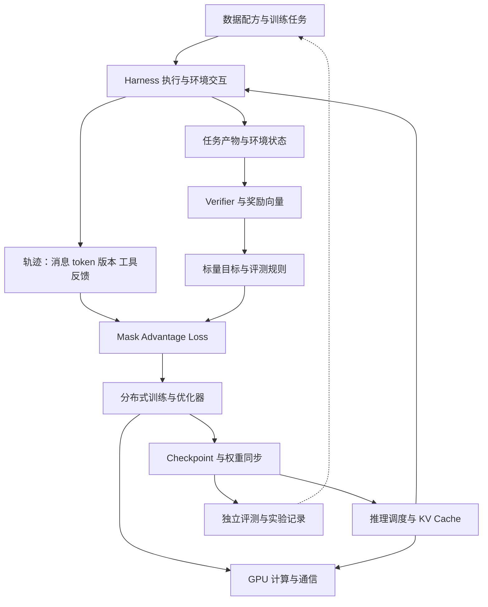

# Frontier LLM 知识树

版本：v0.5，2026-09-11。来源：21 份局部源码笔记、四个局部 CPU 实验，以及 [超大模型训练全流程](handbook/00-end-to-end.md) 的源码 / 一手报告综合。课程按 [ROADMAP](ROADMAP.md) 的 M00–M15 与 F01–F06 学习；下文按问题分支，不代表学习先后。覆盖深度与缺口见 [COVERAGE](COVERAGE.md)。

## 新增的学习连接

从 [首课](lessons/01-one-token-to-update.md) 可以看到同一个对象贯穿多层：交叉熵的有效 token 分母（M02）→ packing 与 masks（M03）→ 分布式梯度归约（M05）→ 轨迹 token 的 RL loss（M11/M13）。[实验 002](experiments/002-token-weighted-loss/README.md) 只验证其中的 CPU 数学关系，没有验证真实集群或 RL。

多模态、蒸馏、新架构与持续学习放入 [前沿专题](curriculum/04-frontier-seminars.md)。它们已有学习问题与一级入口，不能据此宣称全部获得了本地源码或实验支持。

## 从模型诞生过程读取这棵树

```text
能力目标与评测协议
├── 预算与 scaling ladder：先预测，再检验外推
├── 数据工厂：来源 → 去重/污染检查 → tokenizer/shards → mixture
├── 模型配方：架构 × 优化器 × token horizon × 训练/推理成本
└── 大规模执行验收
    ├── 并行布局 × 数值 × 吞吐 × 恢复
    └── 随机初始化 → 主预训练 → base checkpoint
        ├── 按需要做 mid-training / 长上下文
        ├── 后训练分支：SFT、偏好、RL、蒸馏与整合
        │   └── Agent RL：harness/environment → trajectory/reward → update
        └── 独立评估 → 导出/服务 → 授权反馈与下一轮数据
```

这是一棵带反馈的研发树，各阶段可并行准备或从中间 checkpoint 分支。[全流程](handbook/00-end-to-end.md) 给出交付物与进入下一阶段的条件；[跨层契约](notes/connections/end-to-end.md) 说明项目之间怎样传递同一个样本、参数与实验身份。

## 知识树：按要解决的问题组织

```text
Frontier LLM：从任务与数据到学习与执行
│
├── 1. Agent 怎样行动？
│   ├── 模型请求、工具调用、steering 与终止条件
│   ├── context transform、compaction、分叉、恢复
│   ├── live events 与 durable session log
│   └── 项目：Pi、SoL-Pi、DeepSeek Harness、Claude Code / Agent SDK
│
├── 2. 怎样定义任务、环境与反馈？
│   ├── Task / Harness / Runtime 的职责和所有权
│   ├── sandbox 启动、超时、隔离、清理与 artifact
│   ├── verifier 覆盖、奖励向量、scalarization
│   ├── 数据泄漏、held-out evaluation 与失败分类
│   └── 项目：Harbor Cookbook、Harbor、Verifiers
│
├── 3. 模型为什么这样训练？
│   ├── 数据清洗、混合、去重、tokenization 与 doc masking
│   ├── 架构/优化器消融、token budget、长上下文与阶段训练
│   ├── 实验依赖图、缓存、checkpoint、评估与可追溯性
│   └── 项目：SmolLM、OLMo-core、Marin
│
├── 4. 反馈怎样变成参数更新？
│   ├── SFT / preference learning / RLVR
│   ├── trajectory → tokens / roles / masks / reward
│   ├── group advantage、ratio、KL、有效 token 归一化
│   ├── 异步队列、policy staleness、过滤、权重同步
│   ├── token 一致性、共享前缀去重、MoE routing replay
│   └── 项目：Open Instruct、Prime RL、APEX recipe、verl、slime、Miles
│
├── 5. 怎样正确而高效地进行分布式训练？
│   ├── rank / process group / device mesh
│   ├── DP / FSDP / HSDP、TP、PP、CP、EP
│   ├── accumulation、重计算、低精度、通信重叠
│   ├── checkpoint 恢复、编译、profiling 与有效 token 吞吐
│   └── 项目：TorchTitan、Megatron-LM / Megatron Core
│
├── 6. 怎样高效生成 rollout？
│   ├── prefill / decode、batch admission 与调度
│   ├── KV prefix reuse、锁定、驱逐与缓存命名空间
│   ├── CPU/GPU overlap、分离部署、专家并行
│   └── 项目：SGLang
│
└── 7. GPU 上的数据怎样移动和计算？
    ├── shape / layout / precision → grouped GEMM
    ├── JIT 特化、编译缓存、冷启动与热运行
    ├── expert dispatch → compute → combine
    ├── NVLink / RDMA、stream / event 与 buffer lifetime
    └── 项目：DeepGEMM、DeepEP
```

项目可以覆盖多个分支；树中的位置是主学习角色，不是互斥分类。

## 跨层数据流

下图表达系统概念，**不是仓库依赖图**。真实软件连接见 [REPO_RELATIONSHIPS.md](REPO_RELATIONSHIPS.md)。



## 第一轮学到的五条连接

### A. Harness 是 RL 数据生产的一部分

Pi 的工具事件次序与上下文转换、DeepSeek 的日志投影决定了模型实际看见的内容。slime/Miles 要把这样的交互变成可训练 token 序列，因此必须继续处理 token identity、分叉和 loss mask。应用层会话正确与训练层概率正确需要分别验证。

证据：[Pi 笔记](notes/repositories/pi.md)、[DeepSeek 笔记](notes/repositories/deepseek-harness.md)、[RL 连接](notes/connections/rl.md)。真实集成还包括 Verifiers 的 Pi harness adapter。

### B. Reward 是一个跨层接口

任务声明目标，verifier 只检查其覆盖的属性，adapter 决定如何传分数，trainer 优化最终标量。本次实验的错误解仍获得性能分，说明任何单项指标都要放回任务目标中解释。

证据：[Harbor Cookbook 笔记](notes/repositories/harbor-cookbook.md)、[实验 001 原始结果](experiments/001-harbor-reward-contract/results.json)、[环境与 infra 连接](notes/connections/infra.md)。

### C. 算法名称相同，训练语义仍可能不同

本次读到的 Prime RL 与 verl 的 GRPO 分组处理默认值不同；Open Instruct 还分开处理策略更新比率与 train/infer 概率差异修正。比较框架时，需先对齐 advantage、loss denominator、mask 和采样版本，再讨论吞吐。

证据：[RL 连接中归一化对照](notes/connections/rl.md)、[Open Instruct](notes/repositories/open-instruct.md)。结论限定到实际阅读的函数和配置，不外推到所有模式。

### D. MoE 把训练、推理与通信紧密连起来

SGLang 负责生成，Megatron 负责训练；Miles 的 replay 需要对齐两边 expert 路由。更底层的 DeepEP 执行 token 分发/合并，DeepGEMM 消费特定 expert layout。数据布局、stream 和 buffer 生命周期也属于正确性，而不只是性能细节。

证据：[Miles](notes/repositories/miles.md)、[Megatron](notes/repositories/megatron-lm.md)、[SGLang](notes/repositories/sglang.md)、[GPU 连接](notes/connections/infra.md)。不同 DeepEP 接口版本不能未经验证混用。

### E. 研究复现需要两套版本记录

第一套是“我们读了哪份源码”，由本实验室 SHA 快照记录。第二套是“一次实验实际运行了哪些兼容版本”，来自各项目自己的 lock、子模块、镜像和模型/数据版本。独立 clone 的 HEAD 不能替代被依赖版本。

例子：Prime RL 的 Verifiers gitlink、Verifiers 的 Pi npm release、Open Instruct 的 OLMo-core pin，以及 Cookbook 的 Harbor feature branch。见 [版本连接表](REPO_RELATIONSHIPS.md#版本连接表)。

## 接下来要长出的分支

- [ ] 一条 OLMo / Marin 预训练样本从来源、分片、packing / masks 到全局 loss 和 checkpoint 的完整证据链。
- [ ] Marin scaling ladder、当前 hero 运行与中途 cooldown 分支的实际配置差异；历史报告与固定源码如何对应。
- [ ] Pi durable runtime 与低层 loop 的关系：一次取消/恢复会产生哪些可重放事件？
- [ ] 同一个任务如何经过 Verifiers/Pi，再进入 Prime RL 的完整训练 trace？
- [ ] Harbor 多维分数到训练标量的实际消费链路。
- [ ] 长上下文 ablation 如何保持有效 token budget 可比，并避免混入多个变量？
- [ ] 相同 MoE 路由在不同并行切分中如何保持 token 对齐？
- [ ] 环境长尾、生成长尾、权重同步中，当前任务的主要瓶颈在哪里？

新增节点必须有具体问题、源码或实验依据，并链接回项目笔记；猜测保留为待验证问题。

## Claude Code 补上的连接：事件、模型上下文与训练轨迹

[Claude Code 案例](handbook/05-claude-code-harness.md) 将 Pi/DeepSeek 的状态问题推进到 SDK 控制协议、权限回调与长任务。执行日志保存发生了什么，compaction 后的上下文决定下一步看见什么；进入 Agent RL 还要额外保存真实 sampled token、logprob、mask、分支和策略版本。文本 session 不能自动充当可训练轨迹。

[CPU 实验](experiments/harness-state-machine/README.md) 验证权限拒绝前不修改状态、循环预算和未知执行结果。下一步在同一任务、模型和预算下比较有无摘要、笔记和子任务隔离，使用独立 verifier；这些真实模型实验尚未执行。

## SoL-Pi：效率、证据和能力需要共同验收

[SoL-Pi](handbook/06-sol-pi-efficient-harnesses.md) 直接扩展 Pi；Action Fusion 减少可预测的模型往返，ObservationPack 将历史大输出投影为可回读引用，Evidence-Preserving Reducer 校验选中引文，Online Context Compact 结合剩余请求、缓存重建和窗口压力决策。它优化执行过程，公开扩展没有实现模型参数的 RL 更新。

与 [Claude Code](handbook/05-claude-code-harness.md) 和 DeepSeek Harness 对照上下文与生命周期；与 M09 对照缓存经济性；与 M14 比较预算匹配的能力和成本；接入 M13 时另外保留原始 token、logprob、mask 与版本。引用可回读不保证模型会回读，引文真实也不保证摘要完整。

[实验 004](experiments/004-sol-pi-contracts/README.md) 已执行 8 个真实上游成本函数场景。下一步是带独立 verifier 的基线/单开关消融；质量与费用收益尚未由本仓库复现。
