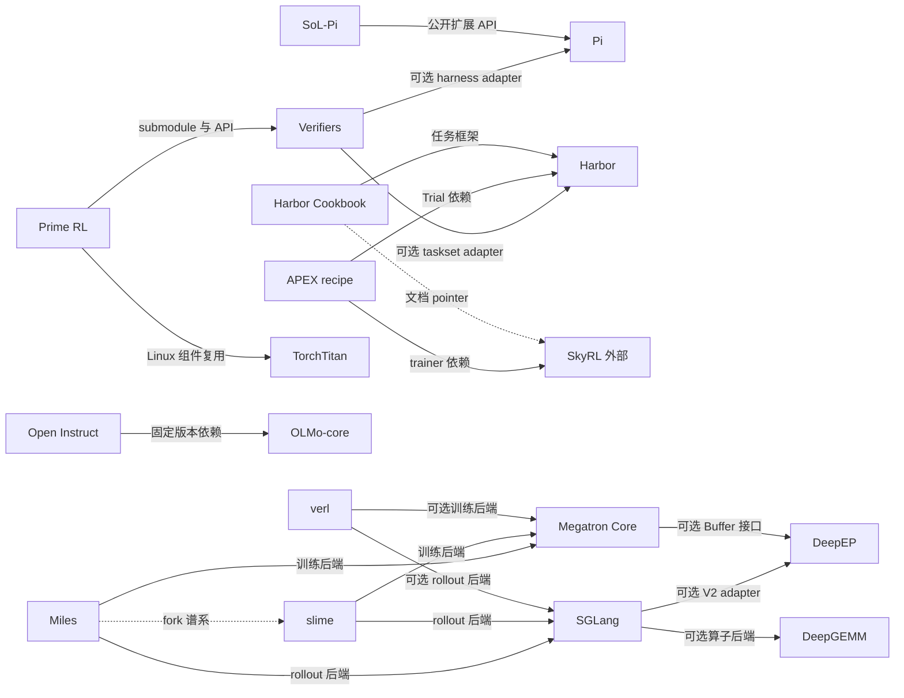

# 仓库关系与证据

日期：2026-09-08。以下关系来自本次固定源码的 imports、配置、gitlink、adapter 或官方谱系说明；不是联合安装后的兼容性验证。

学习者的先修图在 [ROADMAP](ROADMAP.md)，新补的课程与一级外部资源在 [RESOURCE_ATLAS](RESOURCE_ATLAS.md)。学习依赖、概念连接与软件依赖使用不同图；新增外部读物不表示本次已 clone 或集成该软件。

新增 [训练全流程](handbook/00-end-to-end.md) 和 [跨层产物契约](notes/connections/end-to-end.md)：它们按数据、checkpoint、轨迹和权重版本连接研发阶段。那些概念箭头不新增此处的软件依赖；Marin 的 JAX / Levanter 路径与 Megatron / TorchTitan 路径可以对照研究，不能按图直接串成一个训练器。

`A → B` 表示 A 使用 B；箭头标签说明是直接依赖、可选后端还是示例。虚线表示文档指向或谱系，不能当作运行时依赖。未连入此图的项目仍在 [概念知识树](KNOWLEDGE_TREE.md) 中。

## 关系索引

每一行链接到包含固定源码路径和行号的证据笔记。

| 起点 | 终点 | 关系类型与已确认范围 | 证据 |
|---|---|---|---|
| Prime RL | Verifiers | 直接依赖、git submodule、Episode/Trace 接口 | [RL 连接](notes/connections/rl.md) |
| Prime RL | TorchTitan | Linux 依赖，复用 gradient clipping 等组件；不等于使用整个 Titan trainer | [RL 连接](notes/connections/rl.md) |
| Verifiers | Pi | npm release + ACP/provider 的可选 harness adapter | [Verifiers](notes/repositories/verifiers.md) |
| SoL-Pi | Pi | 直接使用公开扩展 API；开发锁定 0.84.2，独立 Pi 快照 0.85.1 未作为兼容组合测试 | [SoL-Pi](notes/repositories/sol-pi.md) |
| Verifiers | Harbor | CLI 与 Python task model 的可选 taskset adapter | [Verifiers](notes/repositories/verifiers.md) |
| Harbor Cookbook | Harbor | 任务框架直接依赖；特定训练脚本另指向 feature branch | [Harness 连接](notes/connections/harness.md) |
| Harbor Cookbook | SkyRL | 文档 pointer，完整集成代码在外部仓库 | [Cookbook](notes/repositories/harbor-cookbook.md) |
| Harbor Cookbook | Prime RL / Verifiers | 文档 pointer，须继续追踪目标快照 | [Cookbook](notes/repositories/harbor-cookbook.md) |
| Harbor Cookbook harbor_rl | Tinker Cookbook | 特定示例代码的外部训练接口 | [Cookbook](notes/repositories/harbor-cookbook.md) |
| APEX recipe | Harbor | Trial/TrialConfig 的直接依赖，Harbor 版本固定 | [APEX](notes/repositories/apex-agents-skyrl-recipe.md) |
| APEX recipe | SkyRL | Generator/fully async trainer 的外部直接依赖 | [RL 连接](notes/connections/rl.md) |
| APEX recipe | Megatron Core | 经 `skyrl[megatron]` 请求后端；不是 recipe 直接实现 Core 调用 | [RL 连接](notes/connections/rl.md) |
| Open Instruct | OLMo-core | SFT 路径直接导入，manifest 固定 commit | [Open Instruct](notes/repositories/open-instruct.md) |
| SmolLM | nanotron | 预训练配方面向外部运行器，主循环不在 SmolLM 仓库 | [SmolLM](notes/repositories/smollm.md) |
| SmolLM FineMath 示例 | datatrove | Python 数据 pipeline 导入；不代表全部 SmolLM3 数据都走该脚本 | [SmolLM](notes/repositories/smollm.md) |
| verl | Megatron Core | 可选训练 engine 的代码依赖 | [verl](notes/repositories/verl.md) |
| verl | SGLang / vLLM | 可选 rollout 后端及版本声明 | [RL 连接](notes/connections/rl.md) |
| slime | Megatron Core | 训练 actor / weight updater 的后端依赖 | [slime](notes/repositories/slime.md) |
| slime | SGLang | 实际启动与管理 rollout 引擎 | [RL 连接](notes/connections/rl.md) |
| Miles | slime | 官方 fork 谱系，不是 Python runtime dependency | [RL 连接](notes/connections/rl.md) |
| Miles | Megatron Core | 训练及 routing replay 层布局代码依赖 | [Miles](notes/repositories/miles.md) |
| Miles | SGLang | 实际 rollout 引擎集成 | [RL 连接](notes/connections/rl.md) |
| Megatron Core | DeepEP | Flex dispatcher 可选后端；所读接口使用 Buffer | [Megatron](notes/repositories/megatron-lm.md) |
| SGLang | DeepEP | 可选 V2 dispatcher；decode/extend 布局分支 | [Infra 连接](notes/connections/infra.md) |
| SGLang | DeepGEMM | 配置和设备满足条件时使用特定 GEMM 算子 | [Infra 连接](notes/connections/infra.md) |
| DeepGEMM benchmark | DeepEP | Mega MoE 的可选 baseline；非所有算子的必需依赖 | [Infra 连接](notes/connections/infra.md) |

## 概念对应：适合对照学习，但不是依赖

| 项目 | 共同问题 | 对照学习要观察什么 |
|---|---|---|
| Pi ↔ DeepSeek Harness | 上下文、工具与持久化事件 | 模型输入从何而来、取消/恢复之后保留什么 |
| SmolLM ↔ OLMo-core ↔ Marin | 数据配方、阶段训练与实验追溯 | 固定 token budget、数据混合、缓存与 checkpoint 来源 |
| TorchTitan ↔ Megatron Core | 分布式训练 | 同一个张量如何切分、梯度如何归一化、通信怎样重叠 |
| Prime RL ↔ verl ↔ slime ↔ Miles ↔ Open Instruct | RL 采样与学习 | advantage、mask、概率修正、版本滞后、权重同步 |
| APEX ↔ Verifiers/Harbor Cookbook | 环境与训练信号 | task、sandbox、artifact、verifier、trajectory 的接口 |
| DeepGEMM ↔ DeepEP | MoE GPU 数据流 | compute layout、通信 handle、stream 与 buffer 所有权 |

证据与讨论：[训练专题](notes/connections/training.md)、[RL 专题](notes/connections/rl.md)、[Harness 专题](notes/connections/harness.md)、[Infra 专题](notes/connections/infra.md)。

## 版本连接表

| 消费者 | 实际锁定或要求 | 本学习目录的边界 |
|---|---|---|
| Prime RL | `deps/verifiers` gitlink 为 `828488fffe31aa3332b9d1bd4bd9ee320e375cf1` | 独立 Verifiers HEAD 是 `27bbd216df0af719a43705866b2cf6139bcc95de`；submodule 内容未初始化 |
| Verifiers Pi adapter | npm Pi coding-agent `0.84.1` | 独立 Pi clone 的 package version 是 `0.85.1`；不是已测试组合 |
| SoL-Pi | 开发依赖为 Pi `0.84.2`；运行期使用 peer dependencies | 独立 Pi clone 为 `0.85.1`，不能用 wildcard peer 范围证明兼容 |
| Open Instruct | OLMo-core pin `fa6c5014c9f6e9ee789da2d9c20d5126fee8df0d` | 独立 OLMo-core HEAD 与该 pin 不同 |
| APEX recipe | Harbor `0.21.0`、作者机器上的 SkyRL 0.3.0 checkout 路径 | 不能用独立 Harbor HEAD 和任意 SkyRL main 直接替代；训练数据未公开 |
| Cookbook harbor_rl | Harbor `feature/harbor-rl-4d0` | 当前独立 Harbor main 没有该示例导入的 `harbor.rl` |
| verl rollout extra | SGLang `0.5.8` | 独立 SGLang HEAD 是阅读快照，不是自动兼容环境 |
| Megatron DeepEP adapter | 本次读到 `deep_ep.Buffer` 路径 | DeepEP 当前主线是 V2 `ElasticBuffer`；需按 backend/版本明确匹配 |

本次对兼容性的发现来自源码和配置，不是安装失败实验。实际运行每个项目时应建立自己的环境锁，不修改来源记录来假装版本已经一致。

## 范围外节点

SkyRL、vLLM、nanotron、datatrove、Tinker Cookbook、TRL/PEFT、DeepSpeed、Ray 等是阅读中出现的外部关联；没有计入本次 21 个独立 clone，也没有递归克隆所有第三方依赖。SkyRL 与 nanotron 是后续扩展的优先候选，因为它们分别补齐 APEX 和 SmolLM 的运行器代码。

## Claude Code / Agent SDK 的两类连接

| 对象 | 关系与证据 | 学习用途 |
|---|---|---|
| Python Agent SDK → Claude Code CLI | 直接运行依赖；[固定源码笔记](notes/repositories/claude-agent-sdk.md) 追 CLI 定位、stream-json 与双向控制响应 | SDK 集成层和 CLI 内部 harness 的边界 |
| Claude Code ↔ Pi / DeepSeek Harness | 概念对应；[对照讲解](handbook/05-claude-code-harness.md)，不是包依赖证据 | 比较上下文、工具事件、恢复与权限 |
| Claude Code ↔ Harbor / APEX / RL | 教学设计上的对应，未实现适配器 | 用独立评分衡量任务；另外保留训练所需 token / logprob / mask / version |

历史镜像按来源和 commit 单列为研究证据，不计入独立官方源码数量，也不作为经过验证的 SDK 配套版本。
