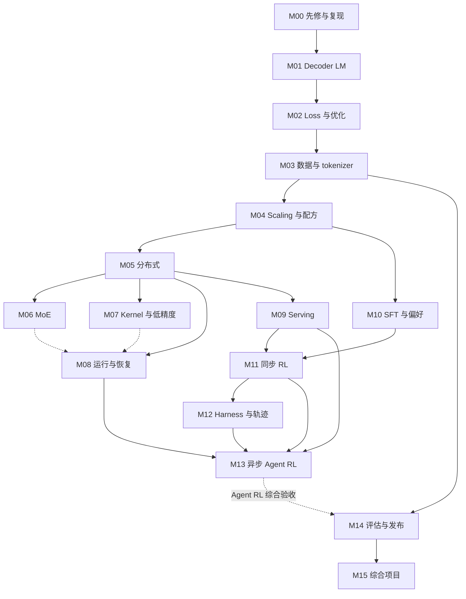

# 学习路线：从会写 Python，到能读懂和验证前沿 LLM 系统

版本：课程 v0.1，2026-09-08。面向没有进入 frontier lab、希望系统接触公开训练与设计知识的学习者。默认会写 Python，但没有训练大模型的经验。

本课程希望你逐步具备四种能力：解释一个模型为何这样设计；把论文中的方法追到实际代码；设计能推翻自己判断的小实验；定位数据、数值、分布式、harness 与评估之间的问题。材料来自公开代码、作者报告、配方、实验记录和课程；公开程度与证据缺口见 [覆盖地图](COVERAGE.md)。

**从这里开始：**先做下面的入门诊断，再进入 M00。想先建立整体方向，可花一个阅读时段浏览 [超大模型诞生全流程](handbook/00-end-to-end.md)。研发发生的顺序与人学习所需的先修顺序不同，因此它不能代替本路线。

## 1. 三种入口，共用一套验收条件

| 你的起点 | 从哪里进入 | 进入前必须拿出的证据 |
|---|---|---|
| 会 Python，没系统学过深度学习 | M00 → M01 → M02 | 能读函数、处理列表/数组、运行脚本；欠缺的数学在 M00 补 |
| 训练过小模型，尚未做过大规模系统 | 做 M01/M02 跳过诊断，通过后从 M03/M04 开始 | 自己解释并检查 attention、交叉熵、梯度、mask 和一次 update |
| 有 ML 或分布式经验，希望转入某方向 | 做相关模块诊断，再走下方专项路线 | 代码、推导、实验或故障分析；工作年限和读过资源数量不替代证据 |

入门自查：你能否解释 `[batch, sequence, hidden]` 三个维度；写一个数值稳定的 softmax；说明训练集和保留集的作用；区别一次 forward 与一次 optimizer update；用 Git 找到当前版本和改动？答不上来就从 M00 开始，不需要先买 GPU 或先读完数学教材。

你也可以先做 [首课：从一个 token 的概率到一次参数更新](lessons/01-one-token-to-update.md)。它用 Python 标准库把 loss、梯度、mask 和跨分片归一化串起来，是 M01/M02 的具体预览；它不替代完整 decoder 的学习。

## 2. 默认学习顺序

核心路线是 **M00–M15**。按表从上到下走；已有基础可用诊断跳过。每行进入的是完整模块说明，包含先修、细目、顺序阅读、练习、验收、产物和工作量估计。

| 模块 | 先解决什么问题 | 主要材料 | 必须留下的学习产物 |
|---|---|---|---|
| [M00 入门与研究复现](curriculum/01-foundations-to-pretraining.md#m00) | 读得懂数学、张量和源码，怎样保存证据？ | 先修桥接、Git、精选 CS336 | 能力诊断、环境与证据记录 |
| [M01 从零理解语言模型](curriculum/01-foundations-to-pretraining.md#m01) | token 如何经 decoder 变成下一个 token 的分布？ | CS336 basics、OLMo | 小模型/关键算子、shape 图、因果性检查 |
| [M02 优化与数值正确性](curriculum/01-foundations-to-pretraining.md#m02) | loss 如何成为正确的参数更新？ | OLMo、TorchTitan、首课 | 梯度检查、mask 与分母反例 |
| [M03 数据与 tokenizer](curriculum/01-foundations-to-pretraining.md#m03) | 怎样把原始材料变成可信训练数据？ | SmolLM、Marin、数据课程 | 数据卡、去重/污染检查、混合统计 |
| [M04 实验设计与预训练配方](curriculum/01-foundations-to-pretraining.md#m04) | 怎样决定模型规模、数据、训练时长与超参数？ | Smol Playbook、OLMo、Marin/Delphi | 预算、受控消融、预测与失败分析 |
| [M05 分布式训练](curriculum/02-training-systems.md#m05) | 参数、样本、梯度在设备之间怎样分布？ | TorchTitan → Megatron、Ultra-Scale | rank 布局图、batch 算术、通信时序 |
| [M06 MoE](curriculum/02-training-systems.md#m06) | 稀疏专家为何影响质量、显存与通信？ | Megatron、DeepEP、Marin | dispatch/compute/combine 与梯度所有权 |
| [M07 GPU、内核与低精度](curriculum/02-training-systems.md#m07) | 为什么 FLOPs 少了却未必更快？ | Triton、FlashAttention、DeepGEMM | 算术强度、数值误差与性能分析设计 |
| [M08 运行、存储与恢复](curriculum/02-training-systems.md#m08) | 怎样让一次长时间训练可诊断、可恢复？ | Megatron/Titan、Marin、3FS | 状态清单、恢复协议、故障 runbook |
| [M09 推理与 rollout 系统](curriculum/02-training-systems.md#m09) | 生成为什么成为后训练的成本中心？ | SGLang | prefill/decode、KV 与调度轨迹 |
| [M10 SFT、偏好与 reward model](curriculum/03-posttraining-and-agents.md#m10) | 示例和偏好怎样改变行为与能力？ | Open Instruct、原始论文 | template/mask、偏好目标与奖励诊断 |
| [M11 同步 RL 最小闭环](curriculum/03-posttraining-and-agents.md#m11) | 概率、奖励和 advantage 如何形成更新？ | PPO/GRPO、Open Instruct、一个 RL 框架 | 手算目标、张量例子、同步时序 |
| [M12 Harness、任务与轨迹](curriculum/03-posttraining-and-agents.md#m12) | 模型实际看见、生成和完成了什么？ | Harbor/Verifiers、Pi/DeepSeek Harness | 环境与评分契约、带来源的 token trace |
| [M13 异步 agent RL](curriculum/03-posttraining-and-agents.md#m13) | 如何在长尾任务中保持吞吐和概率语义？ | Prime RL、slime/Miles、verl、APEX | policy 版本图、队列实验、一致性审计 |
| [M14 独立评估与发布](curriculum/03-posttraining-and-agents.md#m14) | 怎样证明提高的是实际能力？ | lm-eval、Inspect、Harbor | 评估协议、失败分类、不确定性与回归报告 |
| [M15 综合项目](curriculum/03-posttraining-and-agents.md#m15) | 能否独立解释、验证并交付一条完整链路？ | 选择一种兼容参考栈 | 可复核的项目报告与实验/审计产物 |

M14 的基础评估原则从 M03 起反复使用，最终再完成整体发布评估；不能把评估理解为学到最后才开始。M06/M07 在完成 M05 后可以平行；M09 也可在 M05 后提前，但先完成其数值和系统先修。

## 3. 先修关系图

实线表示默认课程需要掌握的先修；虚线表示贯穿应用或回访。它描述学习依赖，不是 Python 包依赖。希望先研究 harness 的读者可以在 M01 后旁听 M12 的应用部分，进入 RL 时仍须补齐概率、优化、serving 和版本语义。

## 4. 有具体方向时怎样缩短路径

| 方向 | 优先路线 | 完成标准 |
|---|---|---|
| 数据 / 预训练研究 | M00–M04 → M05/M08 基础 → M14 → M15 | 数据 lineage、预算匹配的消融、保留评估、完整配方 |
| 训练系统 / infra | M00–M02 → M03/M04 核心 → M05–M09 → M14 → M15 | 数值基线、rank/通信图、profile 与恢复证据 |
| 后训练 / agent RL | M00–M04 核心 → M05/M08/M09 基础 → M10–M14 → M15 | reward 与 token 契约、同步基线、异步差异和独立评估 |
| Harness / agent 工程 | M00/M01 → M12 应用部分 → M03/M14 评估；做参数训练前补 M02/M10/M11/M09 | 受控任务、工具/环境故障、可恢复轨迹、预算匹配评估 |

“核心 / 基础”仍需通过相关模块诊断，不是把它从待办中删除。所有方向最终都要能说明当前工作处于哪一层、上下游输入是什么、哪些结果尚未验证。

完成核心后，按 [前沿专题](curriculum/04-frontier-seminars.md) 选择长上下文新架构、多教师蒸馏、多模态、数据研究或更深的集群基础设施；无需为了跟新论文而同时改学五条路线。

## 5. 不同硬件条件怎样学习

| 可用资源 | 能完成的有效学习 | 对结果的准确称呼 |
|---|---|---|
| 普通电脑 / CPU | 推导、源码追踪、微型数值检查、数据抽样、轨迹/队列模拟、公开 trace 分析 | 机制验证或证据审计 |
| 单张可用 GPU | 小 decoder、短程训练、数值/吞吐对照、受控推理；模型和长度按显存调整 | 特定规模的实验 |
| 多 GPU / 多节点 | collective、TP/PP/CP/EP、真实权重同步、故障恢复与吞吐 | 指定环境下的系统验证 |
| 大规模集群与完整数据 | 接近公开大配方的训练与能力验证 | 满足材料和协议后的规模复现 |

CPU 路线每个核心模块都有产物，不会因没 GPU 无法开始。它能验证算法和接口的一部分；网络拥塞、内核性能、长时间稳定性与最终模型质量需要相应硬件。费用、显存或时长没有适用于所有模型的固定承诺，各模块的工作量只是阅读与小练习的规划估计。

## 6. 怎样安排每周学习

以每周 8–12 小时为一个可调整的节奏：先明确一个问题，读一份主材料，再追对应代码；余下时间做一个对照练习，写下结果与反例。这里的时间是安排建议，不是结业保证。第一轮每模块只读核心资源，选读留给产物暴露的问题。

按各模块本版估计相加，M00–M14 的核心阅读与 CPU 练习约 **254–435 小时**；加无 GPU 审计 capstone 约 **278–480 小时**，选小模型端到端 capstone 约 **304–535 小时**。数学补课、完整原作业、环境准备、GPU 实验和返工另计。按每周 8–12 小时，适合按数月至一年以上的持续项目安排；已有基础可凭诊断缩短，不需要机械累计工时。

建议最初两周这样开始：

1. 第一个时段：读仓库入口与 M00，填入门诊断，只记录真实已有基础。
2. 第二个时段：完成首课，先预测答案，再运行脚本，对照自己的误解。
3. 接下来的时段：进入 M01，画 decoder 的 shape 和因果关系，选择能在当前电脑完成的子任务。
4. 两周末：交付一份可运行的小检查、一页解释和一条未解决问题；没有完成 M01 就继续，不为了赶日历跳过。

每模块结业至少提交四件事：**概念解释、源码证据、可否证练习、限制与下一问**。任选一条关系连接到其他模块，例如“packing 改变有效 token 分母，分布式归约因此必须改变”。记录使用 [学习者模板](templates/learner-progress.md) 和 [实验/决策模板](templates/research-decision.md)。

## 7. 仓库中的不同文档分别负责什么

- **本路线与 curriculum：**告诉学习者先学什么、读哪里、怎样练习、如何验收。
- **handbook：**讲解完整流程和跨层机制，提供真实运行案例。
- **repository notes：**固定源码的局部审读，给出函数、配置与边界。
- **experiments / lessons：**可运行例子、实际结果与可教学解释。
- **RESOURCE_ATLAS：**资源为什么值得读、在哪个模块读、是否已做固定快照。
- **COVERAGE：**领域地图、当前覆盖深度和待补的公开材料。
- **PROGRESS：**维护者实际做了什么，不代表读者已经完成课程。

现有 19 个项目仍是主干，登记编号保留用于稳定索引；**编号不是学习顺序**。每个模块先选一份主实现读透，再与另一份比较，避免在六种 RL 框架之间跳转却无法解释一次更新。

## 8. 什么算学到了实验室工作的能力

试着不看笔记回答：为什么选这份数据和模型；给定预算应怎样设计对照；哪个 mask 改变了目标；哪个通信决定了尾延迟；为什么 checkpoint 恢复不等价；一次高 reward 是能力进步还是评分漏洞；哪条证据会让你放弃当前方案？

这些问题能用推导、源码和实验回答，才形成了可迁移的技能。课程 v0.1 已给出学习路径和模块要求；详尽覆盖不意味着每个方向都有完整教材、所有实验已完成或所有前沿内部知识已公开。成熟度与缺口持续在 [COVERAGE.md](COVERAGE.md) 明示。
