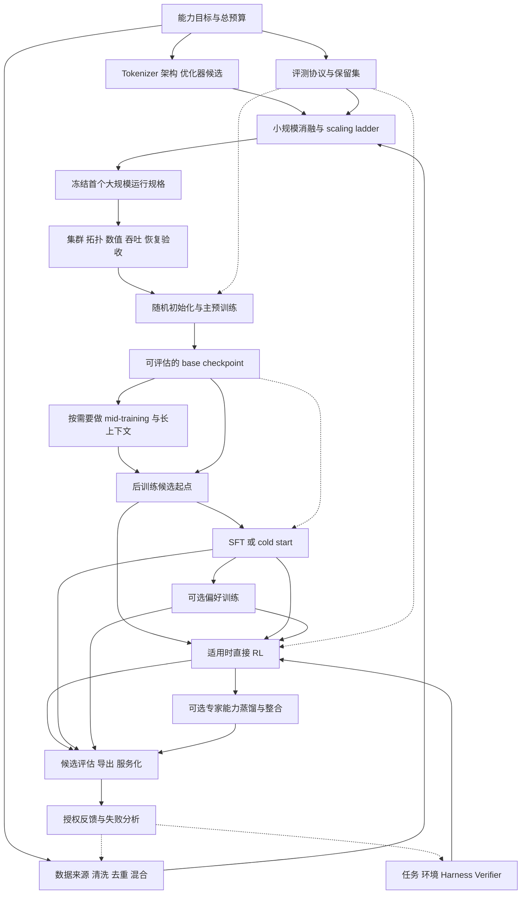

# 超大 LLM 从零训练全流程：从研究决策到可运行的 agent

更新：2026-09-08。范围：以自回归文本 / 代码 LLM 为主，覆盖大型 MoE、长上下文与 agent 后训练；没有展开图像、音频、视频编码器及其对齐训练。

这 19 个仓库可以提供大量一手材料：实际训练配置、数据处理、梯度更新、通信、恢复、任务执行和奖励接口。结合作者技术报告与公开实验记录，可以重建一套相当细致的研发流程。**它们没有共同公开任何闭源前沿模型的完整内部配方，也不是安装在一起就能训练的成套系统。** 本文重建的是有证据支持的工程流程，具体模型仍须做自己的实验。

## 阅读入口与证据规则

| 章节 | 解决的问题 |
|---|---|
| 本篇：全流程 | 每个阶段为何存在、交付什么、怎样进入下一阶段 |
| [01 数据、模型与预训练设计](01-data-model-pretraining-design.md) | scaling pilots、数据工厂、tokenizer、架构、阶段配方 |
| [02 分布式预训练与运行](02-distributed-pretraining-operations.md) | 并行拓扑、训练步、低精度、MoE 通信、恢复与运行门槛 |
| [03 后训练、agent RL 与评估](03-posttraining-agent-rl-evaluation.md) | SFT / preference / RL 分支、轨迹契约、异步训练与独立评估 |
| [04 Marin 535B 实际案例](04-marin-535b-live-case-study.md) | 一个正在进行的超大训练如何做决策，公告、代码与计划如何区分 |

全文使用三种证据层级：**源码事实**限于 [固定快照](../SOURCE_INDEX.md)；**作者报告**注明来源和时点，预测不算完成结果；**工程综合**是我们跨仓库归纳的设计与验收建议，不冒充某家实验室原配方。下文流程和交付物主要属于工程综合，具体事实附链接。没有在本次研究中运行 GPU 训练、集群故障注入或大模型评估。

“现在最前沿”也要有时间坐标。Marin 2026-09-03 的公告描述了已启动的 **535B 总参数 / 23B 激活参数、计划 18T tokens** 预训练，目前不能把计划写成训练完成或性能达标。这是我们新增的公开开发案例。[Marin 发布说明](https://openathena.ai/blog/marin-535b-launch-note/)

## 1. 总图：研发有反馈、分支与并行准备



箭头是知识与产物流，不是仓库依赖。真实集成见 [仓库关系](../REPO_RELATIONSHIPS.md)。环境、数据、系统和评估通常并行建设；也可以从中途 checkpoint 分支做后训练诊断，让主预训练继续运行。

## 2. 先定义模型需要做到什么，再选择规模

**输入：** 目标用户、任务、语言、工具、延迟 / 成本约束，以及真实可用的计算资源。

先写能力矩阵：通识、数学、代码、指令遵循、长文理解、工具使用、长程任务各要达到什么水平。对 agent 明确是否有浏览器、终端、子 agent，允许多少时间、生成 token 和重试。任务成功率如果依赖数十倍推理预算，应当单列。

此时就建立开发集、较少访问的 holdout 和发布评估协议；定义样本来源、时间或任务家族拆分，失败 / 超时的计数方式及统计不确定性。保留评测材料身份，用于后续污染检查。不能等预训练结束才发现“平均 loss 下降，却没有我们要的代码能力”。

**产物：** 能力规格、评测版本、成本口径、优先级，以及分阶段通过 / 退回的标准。没有一个适用于所有模型的统一合格分。

## 3. 做全生命周期算力预算

预算要覆盖数据处理、pilot、失败重跑、主预训练、阶段扩展、后训练采样、teacher / reward 计算、评估和服务。只有主预训练预算，会把后面大量生成与环境执行当成意外开销。

对标准 dense Transformer，`C ≈ 6ND` 可作早期估算：N 为参与主要矩阵计算的参数规模，D 为训练 token 数。它省略 attention 的长度影响、重计算、通信、padding 等成本。MoE 用激活参数替换 N 也只能粗估；总参数仍占据权重和优化器存储，专家路由还增加不规则通信。

```text
预计主训练时间 ≈ 计划训练 token 数 / 实测稳态集群 tokens/s
总墙钟时间     ≈ 主训练时间 + 编译/评估/保存开销 + 故障损失 + 资源等待
```

这里的吞吐必须来自目标 shape、精度、并行方式与硬件的实测。对 packed / masked 数据还应分别记录处理 token 与参与 loss 的有效 token。MFU 的 FLOP 口径、GPU 理论峰值口径要一致；不能拿一个 kernel 的速度代替整项运行速度。

规模候选应同时考虑训练效率与推理可承受性。更稀疏的 MoE 未必在自己的网络上更快；更小且训练更久的模型也可能更适合高请求量服务。先比较几个可运行候选，再定主跑规格。[设计细节与 scaling 证据](01-data-model-pretraining-design.md)

## 4. 建立数据工厂，而不是整理一份下载列表

**输入：** 可使用的网页、代码、文献、书籍、数学、对话等来源，以及数据使用条件。下面是应版本化的逻辑步骤；实际可以分多轮去重和筛选。

```text
来源登记与原始快照
→ 抽取正文 / 结构，保留文档边界
→ 语言与领域识别，质量与格式检查
→ 去重、污染检查、敏感信息处理
→ 分类 / 聚类与质量采样
→ tokenizer 编码和带元数据的 shards
→ 混合、顺序、重复采样与 packing 计划
```

每个 shard 要能追溯来源、处理版本、过滤规则和 token 计数；抽样检查被保留与被丢弃的内容，避免质量打分器把某些语言或领域整体删掉。精确去重、模糊去重、语义近似和评测去污染解决不同问题，任何单项都不能保证完全没有泄漏。

混合比例是可检验的研究决策。记录每个领域的可用唯一 token、计划消费量、重复次数和不同训练阶段的权重。小数据源持续过采样，可能让总 token 看起来很多却增加记忆和过拟合。合成数据也需记录教师、提示、采样、验证和去重；生成了多少不等于得到多少有效训练信息。

**产物：** 数据 manifest、tokenizer 版本、混合计划、污染审计记录、loader 可恢复状态。**门槛：** 数量、质量、来源与分片读取都可核验，并且小实验支持这份 mixture。Marin 的 artifact / dependency 设计可以学习这类 lineage；配置 fingerprint 并不自动覆盖全部源代码与数据内容。[Marin 源码笔记](../notes/repositories/marin.md)

## 5. Tokenizer、模型、优化器和硬件一起定

tokenizer 决定同一内容需要多少 token、语言和代码的表示效率、特殊 token 以及未来工具协议。改变它会影响 embedding、输出头、数据缓存和已有 checkpoint，因此需要在大规模训练前固定并做 round-trip、边界文本、代码和多语言检查。

模型候选至少明确：层数、宽度、attention 形式、位置编码、归一化、激活函数、初始化、词表；MoE 再增加总专家数、每 token 选几个专家、共享专家、容量策略、负载平衡和通信布局。**总参数决定存储规模，激活参数只近似表达每 token 的计算规模。**

优化器、学习率、batch、初始化和参数缩放不能分开拍脑袋。AdamW、Muon 或混合参数组是候选设计，选择依据应是自己的缩放与数值实验。辅助目标如 MTP、router loss / z-loss 也改变训练语义，要记录系数及调度，不要混进“标准交叉熵”后消失。

当前前沿的一种公开例子是 DeepSeek-V4：报告把压缩 / 稀疏 attention、mHC、Muon、训练 / 推理一致性一起讨论；后训练用领域 specialist 与多教师 on-policy distillation 整合能力，并在后训练引入 FP4 QAT。这说明架构、推理预算、数值和后训练要共同设计；并不说明每个新模型都应采用这些模块，或我们的 19 个仓库公开了其完整训练栈。[DeepSeek-V4 报告 §§2–5](https://arxiv.org/html/2606.19348v1)

## 6. 用小规模实验买掉大规模运行的风险

先让小模型确实学会一个受控任务，再逐步扩大参数、token horizon、batch、序列长度和设备数。验证 shifted labels、causal / document masks、packing、梯度与优化器是否正确；“loss 会下降”不足以证明实现正确。

然后分两类实验：一类在相同计算 / token 预算下做数据、架构或优化器消融；另一类做 scaling ladder，测不同尺度的最优配置和训练曲线，再对未参与拟合的较大运行做预测。预测范围、误差和失败记录与最终曲线一样值得学习。Delphi 公开了 scaling recipe、训练系列和提前登记的预测，也记录了首次外推失败后的配方修正。[Delphi 作者报告](https://openathena.ai/blog/delphi/)

最后要有接近生产 shape 的系统验收：不同并行路径数值对照、低精度漂移、完整 checkpoint 恢复、数据吞吐，以及足够长时间的运行稳定性。小模型稳定不证明稀疏路由、高 batch、长上下文和数百节点也稳定。

**产物：** 每项消融的结论 / 不确定性、预测曲线、冻结的首跑配置、回退方案。**门槛：** 研究预测与系统验收都站得住脚，再启动昂贵主跑。[Marin 真实决策链](04-marin-535b-live-case-study.md)

## 7. 让集群跑得正确，再让它跑得快

集群准备包含设备与网络健康、GPU / 驱动 / 通信库兼容、跨节点 collective、存储读写、容器和编译环境；训练数据、checkpoint 与异步评估不能争抢到让主循环停顿。大规模运行要记录坏节点隔离、重试、超时和故障归因。

| 切分方式 | 主要解决什么 | 代价 / 检查点 |
|---|---|---|
| DP、FSDP / ZeRO、HSDP | 样本并行，或分摊参数、梯度与优化器状态 | all-reduce / reduce-scatter / all-gather，正确的梯度归一化 |
| TP | 拆一个层内的大矩阵 | 频繁 collective，尽量利用高速互联 |
| PP | 不同设备放不同层 | bubble、microbatch 调度、层间负载不均 |
| CP / sequence 相关切分 | 长序列激活与 attention 工作 | 上下文通信、mask / 位置语义 |
| EP | 把专家分布到不同设备 | token dispatch / combine、容量与负载长尾 |

这些名称不代表互相独立的 GPU 乘数。尤其 EP 常是同一批设备的另一组 mesh / process groups。应先画出每个 rank 持有的参数、样本、序列与专家，以及每一步发生的通信，再算显存和 batch。

随后逐项引入重计算、低精度、融合 kernel、通信重叠与编译，固定输入做数值和梯度对照。每次优化都要同时记录正确性、稳态吞吐、峰值显存、冷启动和恢复成本。[完整训练步与并行说明](02-distributed-pretraining-operations.md)

## 8. 主预训练：从随机参数到 base model

“从零”在这一阶段意味着模型权重按已验证规则随机初始化，创建优化器 / 调度器状态；使用已有 base checkpoint 继续训练属于 continued pretraining。数据管线可以是既有系统，两者不要混淆。

对自回归语言建模，一个简化的主目标是：

`L_CE = − Σ(m_bt · log pθ(x_b,t+1 | x_b,≤t)) / Σ m_bt`

`m` 指明哪些位置参与目标；分母应与实际有效 token 和分布式梯度缩放契约一致。多个 rank 或 microbatch 的有效长度不同时，直接平均局部平均值可能改变样本权重。

以下为**逻辑示意，不是可执行框架 API**；通信在优化实现中会与计算交错：

```text
恢复 / 初始化：模型、优化器、调度器、数据位置与必要随机状态
for each optimizer step:
    按版本化 mixture 取数 → packing → input / label / position / masks
    在若干 microbatch 上 forward
        attention + FFN / MoE；按配方计算主 loss 与辅助项
    按全局有效 token 语义归一化并 backward，累积梯度
    完成必要的梯度通信，检查有限值与全局 norm，按配置裁剪
    optimizer update → schedule / token / step counters
    记录 loss、数据计数、数值、路由、性能与故障指标
    按策略保存可恢复 checkpoint，异步导出候选并做独立评估
```

框架里最值得追的不是 `train.py` 文件名，而是 `batch → loss → backward → gradient synchronization → optimizer → checkpoint` 这条链。TorchTitan、Megatron、OLMo-core 给出不同实现；Marin 的训练器与实验编排提供另一条路径。

MoE 的一个 token 还要经过 `router → 目的专家 / 权重 → dispatch → grouped expert compute → combine`。出错可能来自路由、重排、通信、buffer 生命周期或输出合并，不能都归咎于 loss。DeepEP / DeepGEMM 能帮助理解这些底层边界，具体接口与兼容版本需单独核对。[GPU / infra 连接](../notes/connections/infra.md)

## 9. 主跑运营：曲线、故障和恢复也是训练技术

至少同时看四组曲线：

- **学习：** 训练与分域验证 loss、实际数据混合、独立能力评估、预测偏差。
- **数值：** 梯度 / 权重 / 激活 norm、非有限值、跳过 step、低精度溢出与关键层异常。
- **MoE：** 专家负载、routing entropy、assignment dropping、通信长尾。
- **系统：** 有效 tokens/s、MFU 口径、step 延迟分位数、loader 等待、保存 / 恢复时间、失败重试和失去的训练进度。

loss spike 发生时，保留出问题前后的 batch 身份、数据变更、配置、路由和节点日志，先判定数据 / 数值 / 系统原因。回滚可以止损，却不自动去掉原因；只跳过样本还可能改变训练分布。

可续训 checkpoint 按实际实现应覆盖权重、优化器状态、必要 master weights、调度器、token / step 计数、数据位置和随机状态；异步保存必须有“完整可用”的提交条件。导出给推理的权重是另一类产物，通常不足以续训。

**可恢复、可换拓扑恢复、逐位可复现是三个不同承诺。** 例如本次 TorchTitan 快照对 rank-local RNG 仍有 TODO；不能因为调用了 distributed checkpoint 就声称精确重现。实践门槛应是用受控短运行比较不中断与恢复后的行为，并明确允许的误差。[恢复边界与源码](02-distributed-pretraining-operations.md)

## 10. Mid-training 与长上下文：有目的地改变分布

主预训练之后，可以增大高质量数学、代码、推理、领域或长文数据的权重，调整学习率与 token 预算；各项目对 mid-training / annealing 的命名和边界不同。OLMo 的正式配方可以用来研究这种阶段分工，不能把名词直接当统一算法。

长上下文扩展要同时决定真实长文比例、packing / doc attention、位置编码、attention 算法、CP、batch 与学习率。全局序列数、序列长度和梯度累积共同决定 token batch；序列切分不会凭空增加独立样本。

验收需要跨位置检索、跨段推理、长代码 / 长文任务，以及短上下文能力回归。能够接收很长输入，或通过一个 needle 测试，不足以证明长程推理有效。对 MoE 还要复查负载分布与 token dropping。[阶段配置与预算例子](01-data-model-pretraining-design.md)

**产物：** 新的 base / mid / long-context checkpoint、变更后的数据与系统规格、独立评估。可以从多种起点试后训练，不必只有一个“最终 base”。

## 11. 后训练先解决行为起点，再选择反馈方式

| 分支 | 数据 / 目标 | 需要解决的具体问题 |
|---|---|---|
| SFT / cold start | 高质量示范；在指定输出区域做监督学习 | chat / tool 协议、指令遵循、可用的初始解题行为 |
| 偏好训练 | chosen / rejected，或训练 reward model 的偏好反馈 | 风格、帮助性、约束与偏好；验证标签可靠性 |
| RLVR / RLHF / rubric judge RL | 可验证结果、奖励模型或判分器 | 从多个尝试中学会提高成功概率；控制奖励代理偏差 |
| rejection sampling / distillation | 经验证的轨迹或教师分布 | 筛选示范、迁移与整合不同能力 |

这些可以分支、交替或省略；SFT→DPO→RL 不是所有模型的必经顺序。先测候选起点在目标任务上能否产生有用探索，再决定是补示范、提高 verifier 质量、改变任务难度还是扩大 RL。

SFT 也需保留实际 template 和 loss mask：用户、工具观察、padding 与 assistant 生成不能无差别地算同一种 action loss。偏好数据质量、reward 校准、reference 模型和 KL 选择都属于训练配方。[详细分支与原始报告](03-posttraining-agent-rl-evaluation.md)

## 12. Agent RL：建立一个不断生产训练数据的系统

与静态预训练相比，agent RL 的训练分布由模型、harness、工具、环境、任务和评分共同产生。

```text
版本化任务与初始环境
→ 固定 / 可追溯的行为策略生成动作
→ harness 调用工具、读观察、管理上下文与停止
→ verifier 检查最终状态 / 产物，记录分项奖励及失败原因
→ 轨迹转换：token、logprob、loss mask、分支、策略版本
→ group advantage / policy objective
→ 分布式参数更新
→ 新版本权重进入 rollout，继续采样
```

最重要的交接是：**learner 必须知道模型当时真正看到了什么、采样了哪些 token，以及这些 token 的概率来自哪版策略。** 把最后一份聊天文本重新 tokenize，并不保证恢复原采样过程。tool response 通常是观察；compaction 与子 agent 分支还会改变上下文和共享前缀的计数。

GRPO 一类方法通常对同一任务采样多条回答，计算组内相对优势，然后在有效动作位置优化带概率比率的目标。但组均值 / 标准差、长度归一化、KL、过滤和共享前缀处理必须看实现；框架名字相同不代表 loss 相同。

将同步扩展到异步，可以减少等待最慢轨迹的时间，但会出现策略陈旧、混合版本、队列偏差和丢弃。要记录 policy version / logprob，控制队列与在途请求，验证权重更新边界。训练 / 推理使用不同数值路径造成的概率差异，则是另一类问题；MoE routing replay 只解决其中部分离散执行差异。

这里可以把 Pi / DeepSeek Harness 的会话机制、Harbor / Verifiers 的环境与奖励、Prime RL / APEX / verl / slime / Miles 的训练编排，以及 SGLang 的采样系统真正连接起来。连接依据是明确的 artifact 与软件 adapter，不是把全部 repo 同时装上。[后训练详章](03-posttraining-agent-rl-evaluation.md)

## 13. 评估、导出和服务化决定最终交付物

训练 reward 上升后仍要问：是否学会钻 verifier 空子？是否依赖训练题变体？是否只靠更多 token / 工具预算？是否牺牲语言、短任务或正常请求完成率？用独立任务、受控预算、保留失败样本和可重复采样回答。

导出阶段检查权重重排、专家编号、tokenizer、chat template、位置编码、精度和量化；对训练器与 serving engine 做选定输入的输出 / 概率和行为对照。线上再测并发、KV cache、prefill / decode、长程任务成本、限流、超时和恢复。

最终交付应包含：模型与 tokenizer、运行协议、数据 / 代码 / 配置版本、完整评估证据、训练恢复材料和部署回退版本。针对授权采集的反馈，先归因到数据、模型、harness、reward 或系统，再决定下一轮改哪层。

## 14. 把 19 个仓库放到恰当的位置

| 学习层 | 主要仓库 | 一手信息的价值与边界 |
|---|---|---|
| 实际数据 / 模型配方 | Marin、OLMo-core、SmolLM | 决策、阶段、配置与 lineage；SmolLM 配方的 nanotron 等运行器有外部依赖 |
| 分布式预训练 | Megatron-LM / Core、TorchTitan | 参数更新与并行系统；支持某功能不证明某个模型采用了它 |
| 后训练算法与编排 | Open Instruct、Prime RL、verl、slime、Miles、APEX recipe | loss、rollout、同步和数据交接；APEX 原训练数据没有公开 |
| Agent 执行与任务 | Pi、DeepSeek Harness、Harbor、Harbor Cookbook、Verifiers | 观察、动作、环境、反馈的实际语义；harness 本身不是预训练器 |
| 生成与底层计算 | SGLang、DeepGEMM、DeepEP | rollout 吞吐、cache、专家计算通信；后端与接口有版本边界 |

研究时可以选几条互补路线：

1. **从实际模型理解配方：** SmolLM / OLMo → Marin 的数据、实验与规模化案例。
2. **从底层理解训练：** TorchTitan 或 Megatron → MoE dispatch / GEMM → checkpoint 与运行诊断。
3. **从任务理解 RL：** Pi / Harbor / Verifiers → 某一个 RL 框架 → 生成与训练后端。

Marin 的 JAX / Levanter 路径与 PyTorch / Megatron 路径是可比较的实现选择，不是前后相接的必经工序。若要真实运行，选一个参考 recipe 的兼容依赖组合，并完成模型导出与接口适配；我们的独立源码 HEAD 是阅读快照。

## 15. 公开资料还缺什么，接下来怎样深入

我们可以学习很多真正的机制，但仍不能从这些仓库还原未公开模型的精确数据、全部 mixture / curriculum、所有消融与失败、完整训练超参数、集群长期可用率、人类标注流程和全部后训练环境。公开权重、公开技术报告、公开训练代码、开放数据及开放开发过程，是不同程度的信息开放。

下一轮最有价值的学习产物是**一条可追溯样本的两次旅程**：

- 预训练：原始文档 → shard / tokenizer → packed batch / masks → loss → 梯度 → checkpoint。
- Agent RL：任务初态 → 实际 token / tool 观察 → reward → advantage / mask → update → 下一版 rollout。

先用 CPU 或小模型验证接口和数值，再逐级增加设备、并行和异步复杂度。机制验证、性能验证和前沿规模复现分别记录，不互相替代。这条路线可与 [学习清单](../LEARNING_LIST.md)、[知识树](../KNOWLEDGE_TREE.md) 和 [学习进度](../PROGRESS.md) 一起继续。
