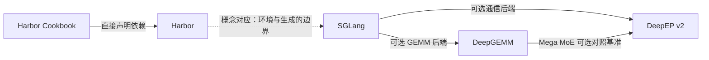

# Infra 关系图：环境反馈、生成调度、计算与通信

日期：2026-09-08。阶段：L1，源码连接审计。方向 `A → B` 表示 A 消费/依赖 B；概念对应单独标注。本页的“已确认”仅指在固定源码中看到接口调用或依赖配置，不代表已安装与端到端运行。

| 连接 | 类型 | 已读证据 | 能推出什么 / 不能推出什么 |
|---|---|---|---|
| Cookbook → Harbor | 直接依赖 | [Cookbook pyproject，11 行](https://github.com/harbor-framework/harbor-cookbook/blob/e093c9a860b988d9d74901010ddddb9c7f124f92/pyproject.toml#L11) | 普通 Cookbook 项目依赖 Harbor；不同训练脚本可能另有分支和额外依赖。 |
| SGLang → DeepEP v2 | 可选后端 | [条件导入与错误保留，38–45 行](https://github.com/sgl-project/sglang/blob/30e7a3072d3f1e9bd70cd5e44146ca27c80522c4/python/sglang/srt/layers/moe/token_dispatcher/deepep_v2.py#L38-L45)，[实际 dispatch，329–345 行](https://github.com/sgl-project/sglang/blob/30e7a3072d3f1e9bd70cd5e44146ca27c80522c4/python/sglang/srt/layers/moe/token_dispatcher/deepep_v2.py#L329-L345) | 存在实际 V2 adapter；不代表任意安装版本兼容，也不是所有 SGLang workload 的默认路径。 |
| SGLang → DeepGEMM | 可选后端 | [设备/可导入性/配置判断，18–36 行](https://github.com/sgl-project/sglang/blob/30e7a3072d3f1e9bd70cd5e44146ca27c80522c4/python/sglang/srt/layers/deep_gemm_wrapper/configurer.py#L18-L36)，[masked GEMM 调用，80–100 行](https://github.com/sgl-project/sglang/blob/30e7a3072d3f1e9bd70cd5e44146ca27c80522c4/python/sglang/srt/layers/deep_gemm_wrapper/entrypoint.py#L80-L100) | wrapper 选择并调用算子；不能把选项存在当成某个模型一定使用它。 |
| DeepGEMM benchmark → DeepEP | 可选测试集成 | [baseline 依赖加载，15–33 行](https://github.com/deepseek-ai/DeepGEMM/blob/559d79fb6994a58b8a15b4b93bf13ccc16edf247/tests/test_mega_moe.py#L15-L33)，[dispatch/GEMM/combine，281–312 行](https://github.com/deepseek-ai/DeepGEMM/blob/559d79fb6994a58b8a15b4b93bf13ccc16edf247/tests/test_mega_moe.py#L281-L312) | 能看见分离流水线对照；依赖导入失败会跳过 baseline，不能只看 fused 运行成功就宣称完成比较。 |
| Harbor ↔ SGLang | 概念对应 | [Harbor 默认 verifier](https://github.com/harbor-framework/harbor/blob/9a2e3b135cc8fb1e41131020f83370cb2f12ae93/src/harbor/verifier/verifier.py#L166-L266)；[SGLang scheduler](https://github.com/sgl-project/sglang/blob/30e7a3072d3f1e9bd70cd5e44146ca27c80522c4/python/sglang/srt/managers/scheduler.py#L1893-L1997) | 前者产出任务反馈，后者调度模型计算。这两段代码不构成直接软件调用关系，连接需由具体 agent/RL 集成建立。 |

## 跨层数据契约

1. **环境层：artifact → reward 字典。** Harbor 默认 verifier 返回任务写出的 reward 维度，不自动为任意多维结果生成 `reward` 标量。训练框架应明确标量化规则；“奖励文件合法”也不等于“奖励能表达正确目标”。
2. **服务层：请求 → token/KV 索引 → batches。** prefix cache 命中需要正确的 token 命名空间；活动请求锁定的 KV 不能被驱逐。调度优化必须兼顾 TTFT、吞吐与分布式同步。
3. **MoE 层：token/top-k → expert rows → 原 token。** DeepEP handle 保留逆路由信息；DeepGEMM 接收 expert-aligned 布局。SGLang v2 adapter 用 decode masked 与 extend contiguous 两种路径，把两库的数据形状与同步约束连接起来。
4. **编译层：shape/layout/dtype → 特化代码 → cache。** DeepGEMM 的冷启动编译、热缓存与稳定 kernel 时间是不同指标，不能混成单个吞吐结论。

## 版本与验证边界

Cookbook 的 [`harbor_rl/train.py:3`](https://github.com/harbor-framework/harbor-cookbook/blob/e093c9a860b988d9d74901010ddddb9c7f124f92/harbor_cookbook/harbor_rl/train.py#L3) 指向 `feature/harbor-rl-4d0`；本次 Harbor main 不包含 `harbor.rl`。该示例是存在代码的集成方向，而非本次 checkout 即可执行的声明。本次未安装依赖、初始化子模块或运行 Docker/GPU，不对安装兼容性、训练收敛与性能结果作验证声明。

详细阅读记录：[Harbor](../repositories/harbor.md)、[SGLang](../repositories/sglang.md)、[DeepGEMM](../repositories/deepgemm.md)、[DeepEP](../repositories/deepep.md)。
