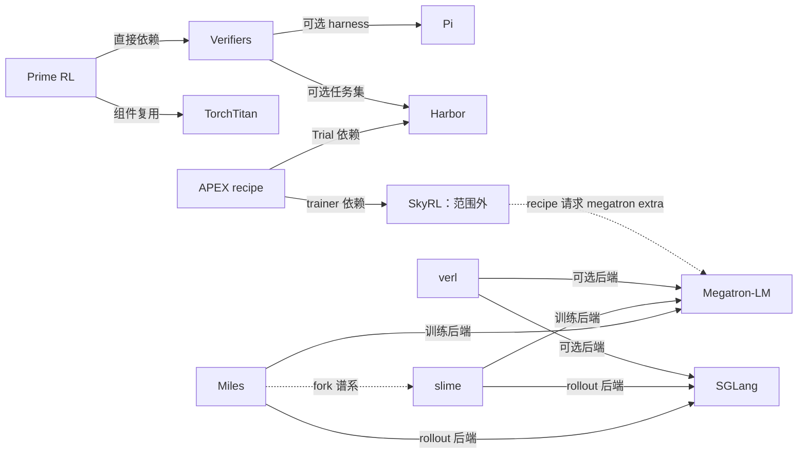

# RL 训练系统的连接：token 轨迹、环境执行、数据队列与计算后端

日期：2026-09-08；证据等级：L1 静态源码阅读。箭头说明软件连接，不表示本机已经安装、兼容或完成端到端验证。

## 经过源码确认的连接

| 起点 → 终点 | 类型 | 固定快照证据 | 应如何理解 |
|---|---|---|---|
| Prime RL → Verifiers | 直接依赖 + submodule | [pyproject 依赖与 source](https://github.com/PrimeIntellect-ai/prime-rl/blob/04a61d3b75c3c99f263b2c133e822f998909adf7/pyproject.toml#L20-L250)，本地 `.gitmodules` 的 `deps/verifiers` | Prime RL 使用 `verifiers.v1` 的 Episode/Trace；训练队列在 Prime RL，环境生命周期在 Verifiers。 |
| Prime RL → TorchTitan | 平台限定直接依赖 / 组件复用 | [Linux dependency](https://github.com/PrimeIntellect-ai/prime-rl/blob/04a61d3b75c3c99f263b2c133e822f998909adf7/pyproject.toml#L54-L62)，[git pin](https://github.com/PrimeIntellect-ai/prime-rl/blob/04a61d3b75c3c99f263b2c133e822f998909adf7/pyproject.toml#L240-L250)，源码 `src/prime_rl/trainer/utils.py:16` 导入 gradient clipping | 这是组件复用证据，不是把整个 Prime RL trainer 等同于 TorchTitan trainer。 |
| Verifiers → Pi | 可选 harness 集成 | [npm 版本、ACP 与 provider 配置](https://github.com/PrimeIntellect-ai/verifiers/blob/27bbd216df0af719a43705866b2cf6139bcc95de/verifiers/v1/harnesses/pi/harness.py#L19-L192) | 被测/被训练模型通过 interception endpoint 供 Pi 使用；Pi npm 版本被单独 pin。 |
| Verifiers → Harbor | 可选任务集依赖 | [CLI 下载与任务模型导入](https://github.com/PrimeIntellect-ai/verifiers/blob/27bbd216df0af719a43705866b2cf6139bcc95de/verifiers/v1/tasksets/harbor/taskset.py#L402-L535) | Harbor task/package 格式被适配到 Verifiers 生命周期，不是任意 Harbor 环境都原样支持。 |
| APEX recipe → Harbor | 直接依赖 | [Trial/TrialConfig imports](https://github.com/Mercor-Intelligence/ApexAgents-SkyRL-Recipe/blob/8e7702f03b7464a36ab800a624fd911de0968a87/apex_agents_skyrl_recipe/tito_harbor_generator.py#L27-L44)，[harbor 0.21.0 pin](https://github.com/Mercor-Intelligence/ApexAgents-SkyRL-Recipe/blob/8e7702f03b7464a36ab800a624fd911de0968a87/pyproject.toml#L6-L15) | APEX 把真实 trial 的结果转为 RL generator output。 |
| APEX recipe → SkyRL | 直接外部依赖 | [fully async trainer import 与构造](https://github.com/Mercor-Intelligence/ApexAgents-SkyRL-Recipe/blob/8e7702f03b7464a36ab800a624fd911de0968a87/apex_agents_skyrl_recipe/entrypoints/main_tito_harbor_fully_async.py#L15-L42)，[本地 path source](https://github.com/Mercor-Intelligence/ApexAgents-SkyRL-Recipe/blob/8e7702f03b7464a36ab800a624fd911de0968a87/pyproject.toml#L114-L117) | **SkyRL 不在本次 19 库 clone 范围。** 本次只读了 recipe 的调用方，没有读本地 SkyRL trainer。 |
| APEX recipe → Megatron-LM | 经 SkyRL extra 的后端依赖 | [skyrl[megatron]](https://github.com/Mercor-Intelligence/ApexAgents-SkyRL-Recipe/blob/8e7702f03b7464a36ab800a624fd911de0968a87/pyproject.toml#L6-L15) | 不应画为 recipe 直接实现 Megatron 训练。中间的 SkyRL 层不能省略。 |
| verl → Megatron-LM | 可选训练后端的代码依赖 | [engine import](https://github.com/verl-project/verl/blob/7cb65014d3a6c84f59458367df768999e4f36c67/verl/workers/engine/megatron/transformer_impl.py#L15-L84) | control flow 与 compute engine 的连接。其他 verl backend 不必经过 Megatron。 |
| verl → SGLang / vLLM | 可选 rollout backend | [setup.py extras](https://github.com/verl-project/verl/blob/7cb65014d3a6c84f59458367df768999e4f36c67/setup.py#L50-L77) | 该快照声明 SGLang 0.5.8；独立 clone 的最新 SGLang 不是自动兼容版本。vLLM 是外部未独立 clone 项目。 |
| slime → SGLang | 直接推理集成 | [ServerArgs 与 HTTP server 启动](https://github.com/THUDM/slime/blob/4c193f1f37509cca70f0e88807a9305b70f63f4e/slime/backends/sglang_utils/sglang_engine.py#L1-L64) | 训练框架实际启动/管理 rollout 引擎，不能把它当作仅 API wrapper。 |
| slime → Megatron-LM | 训练后端代码依赖 | [actor imports / train / weight updater](https://github.com/THUDM/slime/blob/4c193f1f37509cca70f0e88807a9305b70f63f4e/slime/backends/megatron_utils/actor.py#L8-L49) | 由后端实现负责并行计算及权重同步。 |
| Miles → slime | 项目谱系 | [Miles README 的 fork 声明](https://github.com/radixark/miles/blob/3de96596f16b9e6d23ba550c4c47de3479c9f14c/README.md#L107-L112) | fork 关系不是运行时 dependency，也不是 API 等价保证。 |
| Miles → Megatron-LM | 训练后端代码依赖 | [Core 层布局函数导入](https://github.com/radixark/miles/blob/3de96596f16b9e6d23ba550c4c47de3479c9f14c/miles/backends/megatron_utils/replay_utils.py#L1-L24) | MoE replay 需要和 PP/VPP 本地层布局对应。 |
| Miles → SGLang | 直接推理集成 | [ServerArgs 和 launch command](https://github.com/radixark/miles/blob/3de96596f16b9e6d23ba550c4c47de3479c9f14c/miles/backends/sglang_utils/sglang_engine.py#L1-L68) | 本次核实连接入口，未审计完整启动参数组合。 |

图中的 SkyRL→Megatron 由 APEX 的 extra 请求证明意图，具体 SkyRL 内部执行链未在本地阅读；图的事实精度以表格为准。

## 贯穿这些项目的学习问题

### 1. 谁产生了这个 token，谁应该为它接收梯度？

[APEX](../repositories/apex-agents-skyrl-recipe.md) 的 `TITOAgentState` 严格追加采样 token 和观察 token；[slime](../repositories/slime.md) 的 trajectory manager 还需处理消息重写、token 漂移和共享前缀。两者是**概念对应**，不是彼此依赖。

可复用的检查表是：完整 token 与 response region 分界、工具观察 mask、sampled logprob、停止 token、分支去重、group identity。只保存可读文本不足以保证 RL 概率/梯度对应关系。

### 2. “GRPO”名称相同，实际归一化是否相同？

[verl](../repositories/verl.md) 的本次 `compute_grpo_outcome_advantage` 默认按 uid 分组后除组标准差；[Prime RL](../repositories/prime-rl.md) 的本次 `GRPOAlgorithm.score_group` 默认仅减均值。两个观察只覆盖各自所读函数，不能忽略后续 loss/config 再宣称它们是完全相同算法。

比较系统吞吐前，要把 reward shaping、advantage normalization、loss denominator、group size、过滤规则和采样分布一并列入实验控制变量。

### 3. 系统故障是否被混入模型能力评估？

Verifiers 区分 failed 与正常 stopped，APEX 区分 error、timeout、length 与 context_length，Prime RL 区分任务结果与 stale cancellation。它们在不同层回答同一个问题：不能把数据收集失败无条件当作模型答错，也不能把全部失败静默抹掉后仅报告漂亮的成功率。

统一观测至少应包含：全部 attempts、完成且可评分的轨迹、最终参与训练的轨迹、按原因分类的 dropped/cancelled 数、有效 token、wall time。

### 4. token 一致之后，内部计算路径是否也一致？

[Miles](../repositories/miles.md) 的 routing replay 将一致性追到 MoE 的离散 expert index，并处理 microbatch/CP/SP/PP 对齐；这与 [SGLang](../repositories/sglang.md) 的 rollout 执行、[Megatron-LM](../repositories/megatron-lm.md) 的训练并行层相接。

DeepEP/DeepGEMM 对通信与矩阵计算有概念关联，但本次所读 RL 路径没有足够证据把二者全部画成直接依赖。依赖必须从配置/import/调用链继续追，不从项目知名度推断。

## 独立 clone 不等于依赖锁已对齐

- Prime RL 的 `deps/verifiers` gitlink 是 `828488fffe31aa3332b9d1bd4bd9ee320e375cf1`；本学习库独立 Verifiers snapshot 是 `27bbd216df0af719a43705866b2cf6139bcc95de`。
- APEX 锁 Harbor 0.21.0，并指向作者机器上的 SkyRL 0.3.0 release checkout 路径；本地没有这个路径，也没有把 SkyRL 计入 19 库。
- Verifiers 的 Pi adapter 使用 npm release 0.84.1；旁边 Pi 源码是独立 HEAD。
- verl 对 SGLang 的 extra pin 与独立 SGLang HEAD 应分开管理。

这些差别不会阻止 L1 阅读，但会影响 L3 复现。每个训练实验应另记一份真正用到的 backend/model/tokenizer/dataset/image/config 锁，保留当前学习库的独立快照用于比较。
