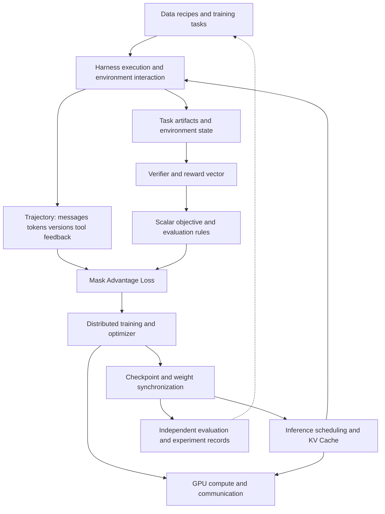

<a id="frontier-llm-知识树"></a>

# Frontier LLM knowledge tree

Version: v0.4, 2026-09-08. Sources: 20 targeted source notes, three limited CPU experiments, and the source / primary-report synthesis in [the full large-model training process](handbook/00-end-to-end.md). Follow M00–M15 and F01–F06 in [ROADMAP](ROADMAP.md) for the course sequence; the branches below are organized by question, not learning order. See [COVERAGE](COVERAGE.md) for coverage depth and gaps.

<a id="新增的学习连接"></a>

## New learning connections

The [first lesson](lessons/01-one-token-to-update.md) shows one object spanning several layers: the effective-token denominator in cross-entropy (M02) → packing and masks (M03) → distributed gradient reduction (M05) → RL loss over trajectory tokens (M11/M13). [Experiment 002](experiments/002-token-weighted-loss/README.md) validates only the CPU mathematical relationships within this chain; it does not validate a real cluster or RL.

Multimodality, distillation, new architectures, and continual learning are placed in the [frontier topics](curriculum/04-frontier-seminars.md). They have learning questions and primary entry points, but that does not support a claim that all have local source or experimental evidence.

<a id="从模型诞生过程读取这棵树"></a>

## Reading the tree through the process of creating a model

```text
Capability objectives and evaluation protocol
├── Budget and scaling ladder: predict first, then test extrapolation
├── Data factory: sources → deduplication/contamination checks → tokenizer/shards → mixture
├── Model recipe: architecture × optimizer × token horizon × training/inference cost
└── Large-scale execution assessment
    ├── Parallel layout × numerics × throughput × recovery
    └── Random initialization → main pretraining → base checkpoint
        ├── Mid-training / long context as needed
        ├── Post-training branches: SFT, preferences, RL, distillation, and integration
        │   └── Agent RL: harness/environment → trajectory/reward → update
        └── Independent evaluation → export/serving → authorized feedback and next-round data
```

This is a research-and-development tree with feedback. Stages can be prepared in parallel or branch from intermediate checkpoints. The [full process](handbook/00-end-to-end.md) provides deliverables and entry conditions for subsequent stages; [cross-layer contracts](notes/connections/end-to-end.md) explains how the same sample, parameters, and experiment identity pass between projects.

<a id="知识树按要解决的问题组织"></a>

## Knowledge tree: organized by problems to solve

```text
Frontier LLMs: from tasks and data to learning and execution
│
├── 1. How does an agent act?
│   ├── Model requests, tool calls, steering, and stopping conditions
│   ├── Context transforms, compaction, branching, recovery
│   ├── Live events and durable session logs
│   └── Projects: Pi, DeepSeek Harness, Claude Code / Agent SDK
│
├── 2. How are tasks, environments, and feedback defined?
│   ├── Responsibilities and ownership of Task / Harness / Runtime
│   ├── Sandbox startup, timeouts, isolation, cleanup, and artifacts
│   ├── Verifier coverage, reward vectors, scalarization
│   ├── Data leakage, held-out evaluation, and failure taxonomy
│   └── Projects: Harbor Cookbook, Harbor, Verifiers
│
├── 3. Why train the model this way?
│   ├── Data cleaning, mixtures, deduplication, tokenization, and document masking
│   ├── Architecture/optimizer ablations, token budgets, long context, and staged training
│   ├── Experiment dependency graphs, caching, checkpoints, evaluation, and traceability
│   └── Projects: SmolLM, OLMo-core, Marin
│
├── 4. How does feedback become a parameter update?
│   ├── SFT / preference learning / RLVR
│   ├── Trajectory → tokens / roles / masks / reward
│   ├── Group advantage, ratios, KL, effective-token normalization
│   ├── Asynchronous queues, policy staleness, filtering, weight synchronization
│   ├── Token consistency, shared-prefix deduplication, MoE routing replay
│   └── Projects: Open Instruct, Prime RL, APEX recipe, verl, slime, Miles
│
├── 5. How can distributed training be correct and efficient?
│   ├── Rank / process group / device mesh
│   ├── DP / FSDP / HSDP, TP, PP, CP, EP
│   ├── Accumulation, recomputation, low precision, communication overlap
│   ├── Checkpoint recovery, compilation, profiling, and effective-token throughput
│   └── Projects: TorchTitan, Megatron-LM / Megatron Core
│
├── 6. How can rollouts be generated efficiently?
│   ├── Prefill / decode, batch admission, and scheduling
│   ├── KV prefix reuse, locking, eviction, and cache namespaces
│   ├── CPU/GPU overlap, disaggregated deployment, expert parallelism
│   └── Project: SGLang
│
└── 7. How does data move and get computed on GPUs?
    ├── Shape / layout / precision → grouped GEMM
    ├── JIT specialization, compilation cache, cold start, and warm execution
    ├── Expert dispatch → compute → combine
    ├── NVLink / RDMA, streams / events, and buffer lifetimes
    └── Projects: DeepGEMM, DeepEP
```

A project can span multiple branches; its position in the tree indicates its main learning role, not an exclusive category.

<a id="跨层数据流"></a>

## Cross-layer dataflow

The diagram below represents systems concepts, **not repository dependencies**. See [REPO_RELATIONSHIPS.md](REPO_RELATIONSHIPS.md) for actual software connections.



<a id="第一轮学到的五条连接"></a>

## Five connections learned in the first round

<a id="a-harness-是-rl-数据生产的一部分"></a>

### A. The harness is part of RL data production

Pi's tool-event ordering and context transforms, and DeepSeek's log projection, determine what the model actually sees. slime/Miles must turn these interactions into trainable token sequences, so they must also handle token identity, branching, and loss masks. Application-level session correctness and training-level probability correctness require separate validation.

Evidence: [Pi notes](notes/repositories/pi.md), [DeepSeek notes](notes/repositories/deepseek-harness.md), [RL connections](notes/connections/rl.md). Actual integrations also include the Pi harness adapter in Verifiers.

<a id="b-reward-是一个跨层接口"></a>

### B. Reward is a cross-layer interface

The task declares the objective; the verifier checks only properties within its coverage; the adapter determines how scores are passed; the trainer optimizes the final scalar. The incorrect solution in this experiment still received a performance score, showing why every individual metric must be interpreted in the context of the task objective.

Evidence: [Harbor Cookbook notes](notes/repositories/harbor-cookbook.md), [Experiment 001 raw results](https://github.com/yubol-bobo/frontier_llm_handbook/blob/main/experiments/001-harbor-reward-contract/results.json), [environment and infrastructure connections](notes/connections/infra.md).

<a id="c-算法名称相同训练语义仍可能不同"></a>

### C. The same algorithm name can still imply different training semantics

The Prime RL and verl implementations reviewed in this round have different defaults for GRPO group handling; Open Instruct also treats policy-update ratios separately from corrections for training/inference probability differences. When comparing frameworks, first align advantages, loss denominators, masks, and sampling versions, then discuss throughput.

Evidence: [normalization comparison in RL connections](notes/connections/rl.md), [Open Instruct](notes/repositories/open-instruct.md). Conclusions are limited to the functions and configurations actually read, not extrapolated to every mode.

<a id="d-moe-把训练推理与通信紧密连起来"></a>

### D. MoE tightly connects training, inference, and communication

SGLang handles generation, while Megatron handles training; replay in Miles must align expert routes on both sides. At a lower level, DeepEP dispatches/combines tokens, and DeepGEMM consumes specific expert layouts. Data layouts, streams, and buffer lifetimes are also correctness requirements, beyond performance details.

Evidence: [Miles](notes/repositories/miles.md), [Megatron](notes/repositories/megatron-lm.md), [SGLang](notes/repositories/sglang.md), [GPU connections](notes/connections/infra.md). Different DeepEP interface versions must not be mixed without validation.

<a id="e-研究复现需要两套版本记录"></a>

### E. Research reproduction requires two sets of version records

The first records “which source code we read,” using this lab's SHA snapshots. The second records “which compatible versions an experiment actually ran,” using each project's own locks, submodules, images, and model/data versions. Independently cloned HEADs cannot replace pinned dependency versions.

Examples: Prime RL's Verifiers gitlink, Verifiers' Pi npm release, Open Instruct's OLMo-core pin, and Cookbook's Harbor feature branch. See the [version connection table](REPO_RELATIONSHIPS.md#版本连接表).

<a id="接下来要长出的分支"></a>

## Branches to grow next

- [ ] A complete evidence chain for one OLMo / Marin pretraining sample, from source, sharding, and packing / masks to global loss and checkpoint.
- [ ] Actual configuration differences among Marin's scaling ladder, current hero run, and intermediate cooldown branches; how historical reports correspond to pinned source code.
- [ ] The relationship between Pi's durable runtime and low-level loop: which replayable events does a cancellation/recovery produce?
- [ ] How does the same task pass through Verifiers/Pi and then enter a complete Prime RL training trace?
- [ ] The actual consumption path from Harbor multidimensional scores to a training scalar.
- [ ] How can long-context ablations keep effective token budgets comparable without changing multiple variables?
- [ ] How do identical MoE routes preserve token alignment under different parallel partitions?
- [ ] Among environment duration tails, generation duration tails, and weight synchronization, where is the current task's main bottleneck?

New nodes must have a concrete question, source or experimental evidence, and links back to project notes; conjectures remain questions to validate.

<a id="claude-code-补上的连接事件模型上下文与训练轨迹"></a>

## The Claude Code connection: events, model context, and training trajectories

The [Claude Code case](handbook/05-claude-code-harness.md) extends the state questions in Pi/DeepSeek to SDK control protocols, permission callbacks, and long-running tasks. An execution log records what happened; context after compaction determines what the next step sees. Agent RL additionally needs actual sampled tokens, logprobs, masks, branches, and policy versions. A text session does not automatically constitute a trainable trajectory.

The [CPU experiment](experiments/harness-state-machine/README.md) verifies no state mutation before a permission denial, loop budgets, and unknown execution outcomes. Next, compare summaries, notes, and subtask isolation under the same task, model, and budget using an independent verifier; these real-model experiments have not been executed.
