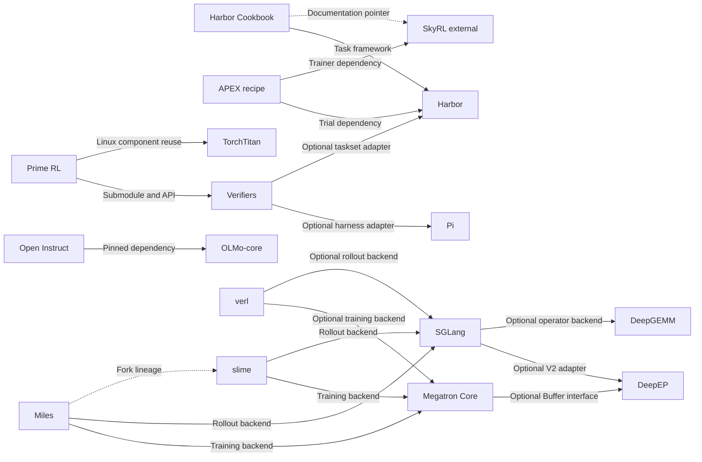

# Repository relationships and evidence

Date: 2026-09-08. The relationships below come from imports, configurations, gitlinks, adapters, or official lineage descriptions in the pinned sources reviewed this round; they are not compatibility validation from a joint installation.

The learner prerequisite graph is in [ROADMAP](ROADMAP.md), and the added curriculum and primary external resources are in [RESOURCE_ATLAS](RESOURCE_ATLAS.md). Learning dependencies, conceptual connections, and software dependencies use different diagrams; adding an external reading does not mean its software was cloned or integrated in this round.

Added [the full training process](handbook/00-end-to-end.md) and [cross-layer artifact contracts](notes/connections/end-to-end.md): these connect development stages through data, checkpoints, trajectories, and weight versions. Their conceptual arrows do not add software dependencies here; Marin's JAX / Levanter path and the Megatron / TorchTitan paths can be compared in study, but the diagram does not allow them to be directly chained into one trainer.

`A → B` means A uses B; arrow labels indicate direct dependencies, optional backends, or examples. Dashed lines indicate documentation pointers or lineage and must not be treated as runtime dependencies. Projects not connected in this diagram still appear in the [conceptual knowledge tree](KNOWLEDGE_TREE.md).

## Relationship index

Each row links to an evidence note containing pinned source paths and line numbers.

| From | To | Relationship type and confirmed scope | Evidence |
|---|---|---|---|
| Prime RL | Verifiers | Direct dependency, git submodule, Episode/Trace interfaces | [RL connections](notes/connections/rl.md) |
| Prime RL | TorchTitan | Linux dependency, reuses components such as gradient clipping; does not imply use of the entire Titan trainer | [RL connections](notes/connections/rl.md) |
| Verifiers | Pi | Optional harness adapter using an npm release + ACP/provider | [Verifiers](notes/repositories/verifiers.md) |
| Verifiers | Harbor | Optional taskset adapter using the CLI and Python task model | [Verifiers](notes/repositories/verifiers.md) |
| Harbor Cookbook | Harbor | Direct task-framework dependency; certain training scripts point to a separate feature branch | [Harness connections](notes/connections/harness.md) |
| Harbor Cookbook | SkyRL | Documentation pointer; complete integration code is in an external repository | [Cookbook](notes/repositories/harbor-cookbook.md) |
| Harbor Cookbook | Prime RL / Verifiers | Documentation pointer; the target snapshot still needs tracing | [Cookbook](notes/repositories/harbor-cookbook.md) |
| Harbor Cookbook harbor_rl | Tinker Cookbook | External training interface used by specific example code | [Cookbook](notes/repositories/harbor-cookbook.md) |
| APEX recipe | Harbor | Direct dependency on Trial/TrialConfig, with a pinned Harbor version | [APEX](notes/repositories/apex-agents-skyrl-recipe.md) |
| APEX recipe | SkyRL | External direct dependency on Generator/fully async trainer | [RL connections](notes/connections/rl.md) |
| APEX recipe | Megatron Core | Requests the backend via `skyrl[megatron]`; the recipe does not implement Core calls directly | [RL connections](notes/connections/rl.md) |
| Open Instruct | OLMo-core | Direct import in the SFT path, with a commit pinned in the manifest | [Open Instruct](notes/repositories/open-instruct.md) |
| SmolLM | nanotron | Pretraining recipes target an external runner; the main loop is not in the SmolLM repository | [SmolLM](notes/repositories/smollm.md) |
| SmolLM FineMath example | datatrove | Python data-pipeline import; does not mean all SmolLM3 data passes through this script | [SmolLM](notes/repositories/smollm.md) |
| verl | Megatron Core | Code dependency for an optional training engine | [verl](notes/repositories/verl.md) |
| verl | SGLang / vLLM | Optional rollout backends and version declarations | [RL connections](notes/connections/rl.md) |
| slime | Megatron Core | Backend dependency for the training actor / weight updater | [slime](notes/repositories/slime.md) |
| slime | SGLang | Actually launches and manages rollout engines | [RL connections](notes/connections/rl.md) |
| Miles | slime | Official fork lineage, not a Python runtime dependency | [RL connections](notes/connections/rl.md) |
| Miles | Megatron Core | Code dependency for training and routing-replay layer layout | [Miles](notes/repositories/miles.md) |
| Miles | SGLang | Actual rollout-engine integration | [RL connections](notes/connections/rl.md) |
| Megatron Core | DeepEP | Optional Flex dispatcher backend; the reviewed interface uses Buffer | [Megatron](notes/repositories/megatron-lm.md) |
| SGLang | DeepEP | Optional V2 dispatcher; decode/extend layout branches | [Infrastructure connections](notes/connections/infra.md) |
| SGLang | DeepGEMM | Uses specific GEMM operators when configuration and device conditions are met | [Infrastructure connections](notes/connections/infra.md) |
| DeepGEMM benchmark | DeepEP | Optional baseline for Mega MoE; not a required dependency of every operator | [Infrastructure connections](notes/connections/infra.md) |

## Conceptual correspondences: useful comparisons, not dependencies

| Projects | Shared problem | What to observe in comparison |
|---|---|---|
| Pi ↔ DeepSeek Harness | Context, tools, and persistent events | Where model inputs come from and what survives cancellation/recovery |
| SmolLM ↔ OLMo-core ↔ Marin | Data recipes, staged training, and experiment traceability | Fixed token budgets, data mixtures, caches, and checkpoint provenance |
| TorchTitan ↔ Megatron Core | Distributed training | How the same tensor is partitioned, gradients are normalized, and communication overlaps |
| Prime RL ↔ verl ↔ slime ↔ Miles ↔ Open Instruct | RL sampling and learning | Advantages, masks, probability corrections, version lag, weight synchronization |
| APEX ↔ Verifiers/Harbor Cookbook | Environments and training signals | Interfaces for tasks, sandboxes, artifacts, verifiers, and trajectories |
| DeepGEMM ↔ DeepEP | MoE GPU dataflow | Compute layouts, communication handles, streams, and buffer ownership |

Evidence and discussion: [training topic](notes/connections/training.md), [RL topic](notes/connections/rl.md), [harness topic](notes/connections/harness.md), [infrastructure topic](notes/connections/infra.md).

## Version connection table

| Consumer | Actual pin or requirement | Boundary of this study directory |
|---|---|---|
| Prime RL | `deps/verifiers` gitlink is `828488fffe31aa3332b9d1bd4bd9ee320e375cf1` | Independent Verifiers HEAD is `27bbd216df0af719a43705866b2cf6139bcc95de`; submodule contents are not initialized |
| Verifiers Pi adapter | npm Pi coding-agent `0.84.1` | Package version in the independent Pi clone is `0.85.1`; this is not a tested combination |
| Open Instruct | OLMo-core pin `fa6c5014c9f6e9ee789da2d9c20d5126fee8df0d` | Independent OLMo-core HEAD differs from that pin |
| APEX recipe | Harbor `0.21.0`, a SkyRL 0.3.0 checkout path on the authors' machine | Independent Harbor HEAD and arbitrary SkyRL main cannot directly replace them; training data is unpublished |
| Cookbook harbor_rl | Harbor `feature/harbor-rl-4d0` | Current independent Harbor main lacks the `harbor.rl` imported by this example |
| verl rollout extra | SGLang `0.5.8` | Independent SGLang HEAD is a reading snapshot, not an automatically compatible environment |
| Megatron DeepEP adapter | The path read in this round uses `deep_ep.Buffer` | Current DeepEP mainline uses V2 `ElasticBuffer`; match backend/version explicitly |

Compatibility findings in this round come from source code and configuration, not failed-installation experiments. Establish a separate environment lock when actually running each project; do not alter provenance records to pretend the versions are already aligned.

## Out-of-scope nodes

SkyRL, vLLM, nanotron, datatrove, Tinker Cookbook, TRL/PEFT, DeepSpeed, Ray, and others are external connections encountered during reading; they are not counted among this round's 20 independent clones, and not all third-party dependencies were recursively cloned. SkyRL and nanotron are priority candidates for future expansion because they supply the runner code missing from APEX and SmolLM, respectively.

## Two kinds of Claude Code / Agent SDK connections

| Target | Relationship and evidence | Learning purpose |
|---|---|---|
| Python Agent SDK → Claude Code CLI | Direct runtime dependency; the [pinned source note](notes/repositories/claude-agent-sdk.md) traces CLI discovery, stream-json, and bidirectional control responses | The boundary between SDK integration and the internal CLI harness |
| Claude Code ↔ Pi / DeepSeek Harness | Conceptual correspondence in the [comparative guide](handbook/05-claude-code-harness.md), not evidence of a package dependency | Compare context, tool events, recovery, and permissions |
| Claude Code ↔ Harbor / APEX / RL | A curriculum connection; no adapter implemented | Score tasks independently and separately retain training tokens / logprobs / masks / versions |

Historical mirrors are recorded separately by provenance and commit as research evidence. They are not counted as independent official source checkouts or treated as verified SDK-compatible versions.
