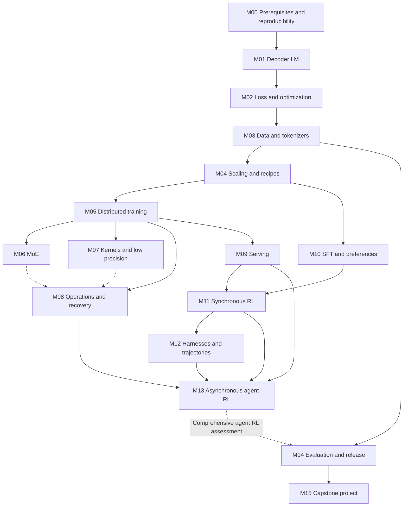

# Learning roadmap: end-to-end frontier LLM training knowledge and engineering skills

Version: curriculum v0.1, 2026-09-08. The goal is to systematically learn end-to-end training for frontier LLMs while building and advancing the corresponding engineering skills. It is for beginners and engineers and researchers seeking to advance, especially learners without frontier lab experience. The default starting point assumes Python proficiency but no large-model training experience; learners with relevant foundations can use assessments to enter later modules.

This course aims to develop four abilities: explain why a model is designed as it is; trace a paper's methods into actual code; design small experiments that could refute your own conclusions; and locate problems across data, numerics, distributed systems, harnesses, and evaluation. Material comes from public code, author reports, recipes, experiment records, and courses; see the [coverage map](COVERAGE.md) for openness and evidence gaps.

**Start here:** Complete the entry assessment below, then enter M00. To get an overall orientation first, spend one reading session browsing [the full process of creating a very large model](handbook/00-end-to-end.md). The order of research and development differs from the prerequisite order for learning, so that overview cannot replace this roadmap.

## Two capability tracks, three levels of advancement

The knowledge track covers objectives and budgets, data, architecture, pretraining and staged training, post-training, inference, evaluation, and release. The engineering track covers implementation, correctness, reproducibility, performance, and reliability. Both advance together in every module.

| Level | End-to-end training knowledge | Engineering skills | Inspectable learning artifacts |
|---|---|---|---|
| Build foundations | Explain how tokens, models, loss, optimization, data, and evaluation form a training loop | Implement key operators and small training loops; check gradients, masks, and data; record reproducible environments | Small runnable implementations, numerical checks, and explanations of errors; primarily established in M00–M04 |
| Deepen skills | Understand tradeoffs in scale, parallelism, MoE, numerical precision, and post-training objectives | Trace real code, design controlled comparisons, locate numerical/data/systems problems, and validate performance and recovery | Source evidence, failure analysis, measurements, or mechanism experiments with clearly stated scope; primarily developed in M05–M14 |
| Apply skills together | Organize a complete data-to-evaluation plan for a specific objective and explain upstream and downstream effects | Implement or audit a pipeline under explicit resource and version constraints, verify results, and propose evidence-backed improvements | M15 capstone: configuration, code or audit evidence, experiment records, evaluation, and limitations |

These are learning goals; see the [coverage map](COVERAGE.md) separately for the current state of instructional material and experiments. CPU exercises can demonstrate correctness for some mechanisms and implementations; actual GPU performance, cluster reliability, and large-scale training skills require evidence from the corresponding environment.

## 1. Three entry points, one set of completion criteria

| Your starting point | Where to enter | Evidence required before entry |
|---|---|---|
| Know Python, but have not studied deep learning systematically | M00 → M01 → M02 | Read functions, work with lists/arrays, and run scripts; fill mathematical gaps in M00 |
| Have trained small models, but have not worked on large-scale systems | Take the M01/M02 skip assessments, then start at M03/M04 if you pass | Independently explain and check attention, cross-entropy, gradients, masks, and one update |
| Have ML or distributed systems experience and want to enter a specialization | Take the relevant module assessments, then follow a specialized path below | Code, derivations, experiments, or failure analysis; years of experience and the number of resources read do not replace evidence |

Entry self-check: Can you explain the three dimensions in `[batch, sequence, hidden]`; write a numerically stable softmax; explain the roles of training and held-out sets; distinguish one forward pass from one optimizer update; and use Git to identify the current version and changes? If not, start with M00. There is no need to buy a GPU or finish a mathematics textbook first.

You can also begin with the [first lesson: from one token's probability to one parameter update](lessons/01-one-token-to-update.md). It connects loss, gradients, masks, and normalization across shards using the Python standard library, providing a concrete preview of M01/M02; it does not replace learning a complete decoder.

## 2. Default learning sequence

The core path is **M00–M15**. Follow the table from top to bottom; use assessments to skip material you already know. Each row links to a complete module specification covering prerequisites, detailed topics, ordered reading, exercises, completion criteria, artifacts, and estimated workload.

| Module | Question to resolve first | Main material | Required learning artifacts |
|---|---|---|---|
| [M00 Getting started and reproducing research](curriculum/01-foundations-to-pretraining.md#m00) | How do you read mathematics, tensors, and source code, and preserve evidence? | Prerequisite bridge, Git, selected CS336 material | Skills assessment, environment and evidence records |
| [M01 Language models from first principles](curriculum/01-foundations-to-pretraining.md#m01) | How does a decoder turn tokens into a distribution over the next token? | CS336 basics, OLMo | Small model/key operators, shape diagram, causality checks |
| [M02 Optimization and numerical correctness](curriculum/01-foundations-to-pretraining.md#m02) | How does loss become a correct parameter update? | OLMo, TorchTitan, first lesson | Gradient checks, mask and denominator counterexamples |
| [M03 Data and tokenizers](curriculum/01-foundations-to-pretraining.md#m03) | How do you turn raw material into trustworthy training data? | SmolLM, Marin, data courses | Data card, deduplication/contamination checks, mixture statistics |
| [M04 Experimental design and pretraining recipes](curriculum/01-foundations-to-pretraining.md#m04) | How do you choose model scale, data, training duration, and hyperparameters? | Smol Playbook, OLMo, Marin/Delphi | Budget, controlled ablations, predictions, and failure analysis |
| [M05 Distributed training](curriculum/02-training-systems.md#m05) | How are parameters, samples, and gradients distributed across devices? | TorchTitan → Megatron, Ultra-Scale | Rank layout, batch arithmetic, communication timeline |
| [M06 MoE](curriculum/02-training-systems.md#m06) | Why do sparse experts affect quality, memory, and communication? | Megatron, DeepEP, Marin | Dispatch/compute/combine and gradient ownership |
| [M07 GPUs, kernels, and low precision](curriculum/02-training-systems.md#m07) | Why do fewer FLOPs not necessarily mean faster execution? | Triton, FlashAttention, DeepGEMM | Arithmetic intensity, numerical error, and performance-analysis design |
| [M08 Operations, storage, and recovery](curriculum/02-training-systems.md#m08) | How do you make a long training run diagnosable and recoverable? | Megatron/Titan, Marin, 3FS | State inventory, recovery protocol, failure runbook |
| [M09 Inference and rollout systems](curriculum/02-training-systems.md#m09) | Why does generation become a major cost in post-training? | SGLang | Prefill/decode, KV, and scheduling traces |
| [M10 SFT, preferences, and reward models](curriculum/03-posttraining-and-agents.md#m10) | How do demonstrations and preferences change behavior and capabilities? | Open Instruct, original papers | Templates/masks, preference objectives, and reward diagnostics |
| [M11 The minimal synchronous RL loop](curriculum/03-posttraining-and-agents.md#m11) | How do probabilities, rewards, and advantages produce an update? | PPO/GRPO, Open Instruct, one RL framework | Hand-calculated objective, tensor example, synchronous timeline |
| [M12 Harnesses, tasks, and trajectories](curriculum/03-posttraining-and-agents.md#m12) | What did the model actually see, generate, and accomplish? | Harbor/Verifiers, Pi/DeepSeek Harness, Claude Code | Environment and scoring contracts, token trace with provenance |
| [M13 Asynchronous agent RL](curriculum/03-posttraining-and-agents.md#m13) | How do you maintain throughput and probability semantics for tasks with long-tailed durations? | Prime RL, slime/Miles, verl, APEX | Policy-version graph, queue experiment, consistency audit |
| [M14 Independent evaluation and release](curriculum/03-posttraining-and-agents.md#m14) | How do you show that actual capabilities improved? | lm-eval, Inspect, Harbor | Evaluation protocol, failure taxonomy, uncertainty and regression report |
| [M15 Capstone project](curriculum/03-posttraining-and-agents.md#m15) | Can you independently explain, validate, and deliver a complete pipeline? | Choose one compatible reference stack | Verifiable project report and experiment/audit artifacts |

Basic evaluation principles from M14 are used repeatedly starting in M03, followed by a complete release evaluation at the end; evaluation must not be understood as something to begin only at the end of the course. M06/M07 can run in parallel after M05. M09 can also be brought forward after M05, provided its numerical and systems prerequisites are completed first.

## 3. Prerequisite graph

Solid lines indicate prerequisites required by the default curriculum; dashed lines indicate continuing applications or topics to revisit. This represents learning dependencies, not Python package dependencies. Readers who want to study harnesses first can audit the application portion of M12 after M01, but must still fill gaps in probability, optimization, serving, and version semantics before entering RL.

## 4. Shortening the path for a specific specialization

| Specialization | Priority path | Completion standard |
|---|---|---|
| Data / pretraining research | M00–M04 → M05/M08 foundations → M14 → M15 | Data lineage, budget-matched ablations, held-out evaluation, complete recipe |
| Training systems / infrastructure | M00–M02 → M03/M04 core → M05–M09 → M14 → M15 | Numerical baseline, rank/communication diagrams, profiling and recovery evidence |
| Post-training / agent RL | M00–M04 core → M05/M08/M09 foundations → M10–M14 → M15 | Reward and token contracts, synchronous baseline, asynchronous differences, and independent evaluation |
| Harness / agent engineering | M00/M01 → M12 applications → M03/M14 evaluation; complete M02/M10/M11/M09 before training parameters | Controlled tasks, tool/environment failures, recoverable trajectories, budget-matched evaluation |

“Core / foundations” still requires passing the relevant module assessments; it does not mean deleting the module from your to-do list. Every specialization must ultimately explain which layer the current work occupies, what its upstream and downstream inputs are, and which results remain unverified.

After completing the core, use the [frontier topics](curriculum/04-frontier-seminars.md) to choose new long-context architectures, multi-teacher distillation, multimodality, data research, or deeper cluster infrastructure. There is no need to switch among five paths at once just to keep up with new papers.

## 5. Learning with different hardware

| Available resources | Useful learning you can complete | Accurate description of the results |
|---|---|---|
| Ordinary computer / CPU | Derivations, source tracing, tiny numerical checks, data sampling, trajectory/queue simulations, public trace analysis | Mechanism validation or evidence audit |
| One available GPU | Small decoder, short training runs, numerical/throughput comparisons, controlled inference; adjust model size and sequence length to memory | Experiment at a specific scale |
| Multiple GPUs / nodes | Collectives, TP/PP/CP/EP, actual weight synchronization, failure recovery, and throughput | Systems validation in a specified environment |
| Large-scale cluster and complete data | Training and capability validation approaching large public recipes | Reproduction at scale after material and protocol requirements are met |

Every core module has a CPU-path artifact, so lack of a GPU does not prevent you from starting. That path can validate some algorithms and interfaces; network congestion, kernel performance, long-run stability, and final model quality require the appropriate hardware. No fixed promise about cost, memory, or duration applies to every model; module workload estimates are planning estimates for reading and small exercises only.

## 6. Planning weekly study

Use 8–12 hours per week as an adjustable rhythm: first define a question, read one main resource, then trace the corresponding code; spend the remaining time on a controlled exercise and record results and counterexamples. This is scheduling advice, not a completion guarantee. On the first pass, read only each module's core resources; leave optional reading for questions exposed by your artifacts.

Adding this edition's module estimates, core reading and CPU exercises for M00–M14 total approximately **254–435 hours**; with a no-GPU audit capstone, approximately **278–480 hours**; with a small-model end-to-end capstone, approximately **304–535 hours**. Mathematics preparation, complete original assignments, environment setup, GPU experiments, and rework are additional. At 8–12 hours per week, plan this as a sustained project lasting several months to more than a year. Prior knowledge can shorten it through assessment; mechanically accumulating hours is unnecessary.

A suggested start for the first two weeks:

1. First session: read the repository entry points and M00, complete the entry assessment, and record only the foundations you actually have.
2. Second session: complete the first lesson; predict the answers before running the script, then compare them with your misconceptions.
3. Following sessions: enter M01, diagram the decoder's shapes and causal relationships, and choose subtasks you can complete on your current computer.
4. End of week two: deliver a small runnable check, one page of explanation, and one unresolved question. If M01 is unfinished, continue; do not skip it to keep up with the calendar.

To complete each module, submit at least four things: **a conceptual explanation, source evidence, a falsifiable exercise, and limitations plus the next question**. Connect one relationship to another module, such as “packing changes the effective-token denominator, so the distributed reduction must change accordingly.” Use the [learner template](templates/learner-progress.md) and [experiment/decision template](templates/research-decision.md) for records.

## 7. What the different documents in this repository do

- **This roadmap and curriculum:** Tell learners what to study first, where to read, how to practice, and how to assess completion.
- **Handbook:** Explains the complete process and mechanisms spanning layers, with real run case studies.
- **Repository notes:** Targeted reviews of pinned source code, identifying functions, configurations, and boundaries.
- **Experiments / lessons:** Runnable examples, actual results, and instructional explanations.
- **RESOURCE_ATLAS:** Explains why a resource is worth reading, which module uses it, and whether a pinned snapshot exists.
- **COVERAGE:** Maps the field, current coverage depth, and public material still to be added.
- **PROGRESS:** Records what the maintainer has actually done; it does not mean the reader has completed the course.

The existing 20 projects remain the backbone, with registration numbers retained as stable references; **the numbers are not the learning sequence**. For each module, first understand one main implementation thoroughly, then compare it with another, instead of moving among six RL frameworks without being able to explain one update.

## 8. What counts as developing the skills for lab work

Try answering without notes: Why choose this data and model? How should you design a controlled comparison under a given budget? Which mask changed the objective? Which communication operation determined tail latency? Why is checkpoint restoration not equivalent? Does a high reward represent improved capability or a scoring loophole? Which evidence would make you abandon the current approach?

Transferable skills emerge when you can answer these questions with derivations, source code, and experiments. Curriculum v0.1 provides the learning path and module requirements; detailed coverage does not mean every specialization has a complete textbook, every experiment has been completed, or all internal frontier knowledge is public. Maturity and gaps remain explicit in [COVERAGE.md](COVERAGE.md).
