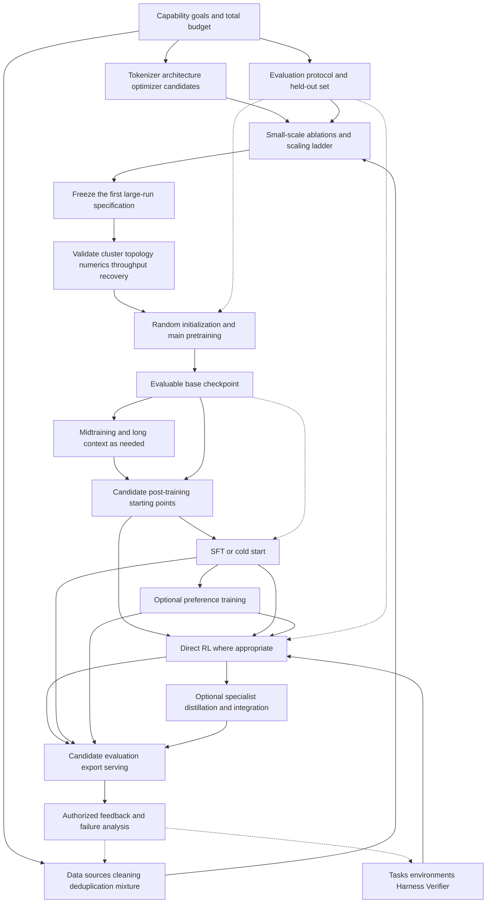

<a id="超大-llm-从零训练全流程从研究决策到可运行的-agent"></a>

# Training a Very Large LLM from Scratch: From Research Decisions to a Working Agent

Updated: 2026-09-08. Scope: primarily autoregressive text/code LLMs, covering large MoE models, long context, and agent post-training; image, audio, and video encoders and their alignment training are not developed here.

This article explains the research and development process. Readers seeking prerequisites, a clear learning sequence, exercises, and self-assessed completion checks should enter M00–M15 through the [ROADMAP](../ROADMAP.md); see [frontier topics](../curriculum/04-frontier-seminars.md) for further study such as multimodality.

These 19 repositories provide substantial primary material: actual training configurations, data processing, gradient updates, communication, recovery, task execution, and reward interfaces. Together with the authors' technical reports and public experiment records, they support a fairly detailed reconstruction of a development process. **They do not collectively disclose the complete internal recipe of any closed frontier model, nor are they a ready-to-train system that works simply by installing everything together.** This article reconstructs an evidence-supported engineering process; each concrete model still requires its own experiments.

<a id="阅读入口与证据规则"></a>

## Reading Entry Points and Evidence Rules

| Chapter | Question addressed |
|---|---|
| This article: end to end | Why each stage exists, what it delivers, and how to enter the next stage |
| [01 Data, Model, and Pretraining Design](01-data-model-pretraining-design.md) | Scaling pilots, data factories, tokenizers, architectures, and stage recipes |
| [02 Distributed Pretraining and Operations](02-distributed-pretraining-operations.md) | Parallel topology, training steps, low precision, MoE communication, recovery, and operational gates |
| [03 Post-training, Agent RL, and Evaluation](03-posttraining-agent-rl-evaluation.md) | SFT/preference/RL branches, trajectory contracts, asynchronous training, and independent evaluation |
| [04 Marin 535B Live Case Study](04-marin-535b-live-case-study.md) | How an ongoing very large training run makes decisions, and how announcements, code, and plans differ |

Three evidence levels are used throughout: **source facts** are limited to the [pinned snapshots](../SOURCE_INDEX.md); **author reports** identify their source and date, and predictions do not count as completed results; **engineering synthesis** consists of design and validation recommendations drawn across repositories, without claiming to be any lab's original recipe. The processes and deliverables below are mainly engineering synthesis, with links for specific facts. No GPU training, cluster fault injection, or large-model evaluation was run during this research.

“Current frontier” also needs a time reference. Marin's 2026-09-03 announcement describes pretraining that has begun for **535B total parameters / 23B active parameters, with 18T tokens planned**. The plan cannot yet be presented as completed training or achieved performance. This is the public-development case newly added here. [Marin launch note](https://openathena.ai/blog/marin-535b-launch-note/)

<a id="1-总图研发有反馈分支与并行准备"></a>

## 1. Overview: Development Has Feedback, Branches, and Parallel Preparation



Arrows show knowledge and artifact flow, not repository dependencies. See [repository relationships](../REPO_RELATIONSHIPS.md) for actual integrations. Environments, data, systems, and evaluation are usually built in parallel; post-training diagnostics can also branch from intermediate checkpoints while main pretraining continues.

<a id="2-先定义模型需要做到什么再选择规模"></a>

## 2. Define What the Model Must Do Before Choosing Its Scale

**Inputs:** target users, tasks, languages, tools, latency/cost constraints, and compute resources that are actually available.

First write a capability matrix: required levels for general knowledge, mathematics, code, instruction following, long-document understanding, tool use, and long-horizon tasks. For agents, specify access to browsers, terminals, and subagents, along with time, generated-token, and retry budgets. Report task success that depends on tens of times more inference budget separately.

Establish a development set, a less frequently accessed holdout, and a release-evaluation protocol now. Define splits by sample source, time, or task family, how failures/timeouts count, and statistical uncertainty. Preserve evaluation-material identities for later contamination checks. Do not wait until pretraining ends to discover that average loss decreased without delivering the coding capability you needed.

**Deliverables:** capability specifications, evaluation versions, cost definitions, priorities, and pass/return criteria for each stage. There is no single qualifying score suitable for every model.

<a id="3-做全生命周期算力预算"></a>

## 3. Budget Compute Across the Full Lifecycle

The budget must cover data processing, pilots, failed-run retries, main pretraining, stage extensions, post-training sampling, teacher/reward computation, evaluation, and serving. Budgeting only main pretraining turns substantial later generation and environment execution into unexpected costs.

For a standard dense Transformer, `C ≈ 6ND` can serve as an early estimate: N is the parameter scale participating in the main matrix computations, and D is the training-token count. It omits attention's length-dependent cost, recomputation, communication, padding, and other costs. Replacing N with active parameters for MoE remains only a rough estimate; total parameters still occupy weight and optimizer storage, and expert routing adds irregular communication.

```text
Estimated main-training time ≈ planned training tokens / measured steady-state cluster tokens/s
Total wall-clock time        ≈ main-training time + compilation/evaluation/saving overhead + failure losses + resource waits
```

Throughput here must be measured at the target shapes, precision, parallelism, and hardware. For packed/masked data, separately record processed tokens and valid target tokens participating in loss. MFU's FLOP definition and the GPU theoretical-peak definition must match; a single kernel's speed cannot stand in for the speed of the entire run.

Scale candidates should consider both training efficiency and affordable inference. A sparser MoE may not run faster on your network; a smaller model trained longer may suit high-request-volume serving better. Compare several runnable candidates before fixing the main-run specification. [Design details and scaling evidence](01-data-model-pretraining-design.md)

<a id="4-建立数据工厂而不是整理一份下载列表"></a>

## 4. Build a Data Factory, Not Just a Download List

**Inputs:** usable sources of web pages, code, literature, books, mathematics, conversations, and their terms of use. The following logical steps should be versioned; actual processing may use multiple deduplication and filtering passes.

```text
Source registration and raw snapshots
→ Extract text / structure, preserving document boundaries
→ Identify language and domain, check quality and formatting
→ Deduplicate, check contamination, handle sensitive information
→ Classify / cluster and sample by quality
→ Tokenizer encoding and shards with metadata
→ Plan mixtures, ordering, repeated sampling, and packing
```

Each shard must trace back to provenance, processing versions, filtering rules, and token counts. Inspect samples of both retained and discarded content to avoid a quality scorer removing entire languages or domains. Exact deduplication, fuzzy deduplication, semantic similarity, and evaluation decontamination solve different problems; none alone guarantees the complete absence of leakage.

Mixture proportions are testable research decisions. Record available unique tokens, planned consumption, repetition counts, and stage-specific weights for each domain. Continuously oversampling a small source can inflate token totals while increasing memorization and overfitting. Synthetic data also requires records of teachers, prompts, sampling, verification, and deduplication; the quantity generated is not the quantity of useful training information obtained.

**Deliverables:** data manifests, tokenizer version, mixture plan, contamination-audit records, and recoverable loader state. **Gate:** quantities, quality, provenance, and shard reads are verifiable, and small experiments support the mixture. Marin's artifact/dependency design illustrates this kind of lineage; a configuration fingerprint does not automatically cover all source code and data contents. [Marin source notes](../notes/repositories/marin.md)

<a id="5-tokenizer模型优化器和硬件一起定"></a>

## 5. Design the Tokenizer, Model, Optimizer, and Hardware Together

The tokenizer determines how many tokens the same content needs, representation efficiency for languages and code, special tokens, and future tool protocols. Changing it affects embeddings, the output head, data caches, and existing checkpoints, so fix it before large-scale training and test round trips, boundary text, code, and multiple languages.

At minimum, model candidates must specify depth, width, attention form, positional encoding, normalization, activation functions, initialization, and vocabulary. MoE adds total experts, experts selected per token, shared experts, capacity policy, load balancing, and communication layout. **Total parameters determine storage scale; active parameters only approximate the computation scale per token.**

Optimizer, learning rate, batch, initialization, and parameter scaling cannot be chosen independently by intuition. AdamW, Muon, or mixed parameter groups are candidate designs whose selection should follow your own scaling and numerical experiments. Auxiliary objectives such as MTP and router loss/z-loss also change training semantics; record their coefficients and schedules instead of letting them disappear into “standard cross-entropy.”

A public example of the current frontier is DeepSeek-V4: its report discusses compressed/sparse attention, mHC, Muon, and training/inference consistency together. Post-training integrates capabilities through domain specialists and multi-teacher on-policy distillation, and introduces FP4 QAT. This illustrates why architecture, inference budgets, numerics, and post-training need joint design; it does not mean every new model should adopt these modules or that these 19 repositories disclose its complete training stack. [DeepSeek-V4 report §§2–5](https://arxiv.org/html/2606.19348v1)

<a id="6-用小规模实验买掉大规模运行的风险"></a>

## 6. Use Small Experiments to Reduce Large-Run Risk

First make a small model actually learn a controlled task, then gradually increase parameters, token horizon, batch, sequence length, and device count. Verify shifted labels, causal/document masks, packing, gradients, and the optimizer; falling loss alone does not establish a correct implementation.

Then separate two types of experiment: data, architecture, or optimizer ablations at equal compute/token budgets; and a scaling ladder that measures optimal configurations and learning curves at different scales, then predicts a larger run excluded from fitting. Prediction ranges, errors, and failure records are as instructive as final curves. Delphi publicly shares its scaling recipe, training series, and preregistered predictions, including recipe revisions after its first extrapolation failure. [Delphi authors' report](https://openathena.ai/blog/delphi/)

Finally, validate the system at shapes close to production: numerical comparisons across parallel paths, low-precision drift, full checkpoint recovery, data throughput, and stability over a sufficiently long run. Small-model stability does not establish stability for sparse routing, large batches, long context, or hundreds of nodes.

**Deliverables:** conclusions/uncertainties for each ablation, prediction curves, a frozen first-run configuration, and a fallback plan. **Gate:** launch the expensive main run only when both research predictions and system checks are defensible. [Marin's actual decision chain](04-marin-535b-live-case-study.md)

<a id="7-让集群跑得正确再让它跑得快"></a>

## 7. Make the Cluster Correct Before Making It Fast

Cluster preparation covers device and network health, GPU/driver/communication-library compatibility, cross-node collectives, storage reads/writes, containers, and compilation environments. Training data, checkpoints, and asynchronous evaluation must not contend enough to stall the main loop. Large runs must record bad-node isolation, retries, timeouts, and failure attribution.

| Partitioning method | Main purpose | Costs / checkpoints |
|---|---|---|
| DP, FSDP / ZeRO, HSDP | Sample parallelism or sharing the storage burden of parameters, gradients, and optimizer states | All-reduce / reduce-scatter / all-gather, correct gradient normalization |
| TP | Split large matrices within a layer | Frequent collectives; use high-speed interconnects where possible |
| PP | Place different layers on different devices | Bubbles, microbatch scheduling, imbalance between layers |
| CP / sequence-related partitioning | Long-sequence activations and attention work | Context communication, mask / position semantics |
| EP | Distribute experts across devices | Token dispatch / combine, capacity and long-tailed load |

These names do not imply independent GPU multipliers. EP in particular often uses another mesh/process-group arrangement over the same devices. First draw the parameters, samples, sequences, and experts held by each rank and the communication at each step; then calculate memory and batch size.

Next introduce recomputation, low precision, fused kernels, communication overlap, and compilation one at a time, using fixed inputs for numerical and gradient comparisons. Each optimization must record correctness, steady-state throughput, peak GPU memory, cold-start cost, and recovery cost together. [Complete training step and parallelism explanation](02-distributed-pretraining-operations.md)

<a id="8-主预训练从随机参数到-base-model"></a>

## 8. Main Pretraining: From Random Parameters to a Base Model

“From scratch” at this stage means randomly initializing model weights according to validated rules and creating optimizer/scheduler states. Training onward from an existing base checkpoint is continued pretraining. The data pipeline may be an existing system; do not confuse the two.

For autoregressive language modeling, a simplified main objective is:

`L_CE = − Σ(m_bt · log pθ(x_b,t+1 | x_b,≤t)) / Σ m_bt`

`m` identifies positions participating in the objective. The denominator must agree with actual valid target tokens and the distributed gradient-scaling contract. When ranks or microbatches have unequal valid lengths, directly averaging local averages can change sample weights.

The following is a **logical sketch, not an executable framework API**; optimized implementations interleave communication with computation:

```text
Restore / initialize: model, optimizer, scheduler, data position, and necessary random state
for each optimizer step:
    Read data from the versioned mixture → packing → input / label / position / masks
    Forward over several microbatches
        attention + FFN / MoE; compute main loss and auxiliary terms according to the recipe
    Normalize using global valid-target-token semantics, backward, and accumulate gradients
    Complete required gradient communication, check finite values and global norm, clip as configured
    optimizer update → schedule / token / step counters
    Record loss, data counts, numerical, routing, performance, and failure metrics
    Save recoverable checkpoints according to policy; asynchronously export candidates and evaluate independently
```

The most valuable framework path to trace is not a filename such as `train.py`, but `batch → loss → backward → gradient synchronization → optimizer → checkpoint`. TorchTitan, Megatron, and OLMo-core provide different implementations; Marin's trainer and experiment orchestration offer another path.

An MoE token also passes through `router → destination experts / weights → dispatch → grouped expert compute → combine`. Errors can arise in routing, permutation, communication, buffer lifetimes, or output combination; they cannot all be attributed to loss. DeepEP/DeepGEMM help explain these lower-level boundaries, but concrete interfaces and compatible versions require separate checks. [GPU / infrastructure connections](../notes/connections/infra.md)

<a id="9-主跑运营曲线故障和恢复也是训练技术"></a>

## 9. Main-Run Operations: Curves, Failures, and Recovery Are Training Techniques Too

Monitor at least four groups of curves together:

- **Learning:** training and per-domain validation loss, actual data mixture, independent capability evaluation, and prediction deviation.
- **Numerics:** gradient/weight/activation norms, nonfinite values, skipped steps, low-precision overflow, and anomalies in key layers.
- **MoE:** expert load, routing entropy, assignment dropping, and communication tail latency.
- **Systems:** valid target tokens/s, MFU definition, step-latency quantiles, loader waits, save/recovery time, failed retries, and lost training progress.

When a loss spike occurs, preserve batch identities, data changes, configurations, routing, and node logs around the event, then distinguish data, numerical, and systems causes. Rollback can limit damage without removing the cause; skipping samples may also change the training distribution.

A resumable checkpoint should cover weights, optimizer states, necessary master weights, scheduler, token/step counters, data position, and random state according to the actual implementation. Asynchronous saving needs a commit condition for complete usability. Weights exported for inference are a different artifact and are usually insufficient to resume training.

**Recoverability, recovery under a different topology, and bitwise reproducibility are three different promises.** For example, this TorchTitan snapshot still has a TODO for rank-local RNG. Calling distributed checkpoint code does not justify a claim of exact reproduction. A practical gate is a controlled short-run comparison of uninterrupted and resumed behavior with explicit error tolerances. [Recovery boundaries and source](02-distributed-pretraining-operations.md)

<a id="10-mid-training-与长上下文有目的地改变分布"></a>

## 10. Midtraining and Long Context: Change the Distribution Deliberately

After main pretraining, a recipe may increase the weight of high-quality mathematics, code, reasoning, domain-specific, or long-document data and adjust the learning rate and token budget. Projects differ in their naming and boundaries for midtraining/annealing. OLMo's official recipes can illustrate this division of stages; the names themselves are not universal algorithms.

Long-context extension requires jointly choosing the proportion of genuine long documents, packing/document attention, positional encoding, attention algorithms, CP, batch, and learning rate. Global sequence count, sequence length, and gradient accumulation jointly determine the token batch; sequence partitioning does not create independent samples.

Validation needs retrieval across positions, cross-segment reasoning, long-code/long-document tasks, and short-context regression checks. Accepting very long inputs or passing one needle test does not establish effective long-range reasoning. MoE also requires rechecking load distributions and token dropping. [Stage configurations and budget examples](01-data-model-pretraining-design.md)

**Deliverables:** new base/mid/long-context checkpoints, revised data and system specifications, and independent evaluation. Post-training may be tried from multiple starting points; there need not be one final base.

<a id="11-后训练先解决行为起点再选择反馈方式"></a>

## 11. Establish the Behavioral Starting Point, Then Choose the Feedback Method

| Branch | Data / objective | Concrete problem to solve |
|---|---|---|
| SFT / cold start | High-quality demonstrations; supervised learning over specified output regions | Chat / tool protocols, instruction following, and usable initial problem-solving behavior |
| Preference training | Chosen / rejected responses, or preference feedback for training a reward model | Style, helpfulness, constraints, and preferences; validate label reliability |
| RLVR / RLHF / rubric judge RL | Verifiable outcomes, reward models, or scorers | Learn to improve success probability from multiple attempts; control reward-proxy bias |
| Rejection sampling / distillation | Verified trajectories or teacher distributions | Select demonstrations, transfer, and integrate capabilities |

These stages may branch, alternate, or be omitted; SFT → DPO → RL is not mandatory for every model. First test whether a candidate starting point produces useful exploration on target tasks, then decide whether to add demonstrations, improve the verifier, change task difficulty, or scale RL.

SFT must also preserve the actual template and loss mask. User text, tool observations, padding, and assistant generation must not indiscriminately count toward the same action loss. Preference-data quality, reward calibration, the reference model, and KL choices all belong to the training recipe. [Detailed branches and original reports](03-posttraining-agent-rl-evaluation.md)

<a id="12-agent-rl建立一个不断生产训练数据的系统"></a>

## 12. Agent RL: Build a System That Continuously Produces Training Data

Compared with static pretraining, the training distribution in agent RL is jointly produced by the model, harness, tools, environment, tasks, and scoring.

```text
Versioned tasks and initial environments
→ A fixed / traceable behavior policy generates actions
→ The harness calls tools, reads observations, manages context and stopping
→ The verifier checks final state / artifacts, recording reward components and failure reasons
→ Trajectory conversion: tokens, logprobs, loss masks, branches, policy versions
→ Group advantage / policy objective
→ Distributed parameter update
→ New-version weights enter rollout and sampling continues
```

The most important handoff is this: **the learner must know what the model actually saw, which tokens it sampled, and which policy version supplied their probabilities.** Retokenizing the final chat text does not guarantee recovery of the original sampling process. Tool responses are usually observations; compaction and subagent branches also change context and shared-prefix counting.

GRPO-style methods typically sample several responses for the same task, compute within-group relative advantages, and optimize a probability-ratio objective at valid action positions. But group means/standard deviations, length normalization, KL, filtering, and shared-prefix treatment must be checked in the implementation; the same framework name does not imply the same loss.

Moving from synchronous to asynchronous execution can reduce time spent waiting for the slowest trajectory, while introducing stale policies, mixed versions, queue bias, and dropping. Record policy versions/logprobs, control queues and in-flight requests, and validate weight-update boundaries. Probability discrepancies from different numerical paths in training and inference are a separate problem; MoE routing replay addresses only part of the discrete-execution discrepancy.

Here, the session mechanisms of Pi/DeepSeek Harness, the environments and rewards of Harbor/Verifiers, the training orchestration of Prime RL/APEX/verl/slime/Miles, and SGLang's sampling system can be connected concretely. Connections depend on explicit artifacts and software adapters, not installing every repository at once. [Detailed post-training chapter](03-posttraining-agent-rl-evaluation.md)

<a id="13-评估导出和服务化决定最终交付物"></a>

## 13. Evaluation, Export, and Serving Define the Final Deliverable

Even after training reward rises, ask whether the model has learned to exploit the verifier, relies on variants of training questions, benefits only from larger token/tool budgets, or sacrifices languages, short tasks, or normal-request completion. Answer with independent tasks, controlled budgets, retained failure samples, and repeatable sampling.

At export, check weight permutation, expert numbering, tokenizer, chat template, positional encoding, precision, and quantization. Compare selected inputs between the trainer and serving engine for outputs/probabilities and behavior. In deployment, also measure concurrency, KV cache, prefill/decode, long-horizon task cost, rate limits, timeouts, and recovery.

The final delivery should include the model and tokenizer, operating protocol, data/code/configuration versions, complete evaluation evidence, training-recovery materials, and a deployment rollback version. For feedback collected with authorization, first attribute issues to data, model, harness, reward, or system before deciding which layer to change next.

<a id="14-把-19-个仓库放到恰当的位置"></a>

## 14. Put the 19 Repositories in Their Proper Roles

| Learning layer | Main repositories | Value and boundaries of primary information |
|---|---|---|
| Actual data / model recipes | Marin, OLMo-core, SmolLM | Decisions, stages, configurations, and lineage; runners such as nanotron in SmolLM recipes are external dependencies |
| Distributed pretraining | Megatron-LM / Core, TorchTitan | Parameter updates and parallel systems; feature support does not prove a model used that feature |
| Post-training algorithms and orchestration | Open Instruct, Prime RL, verl, slime, Miles, APEX recipe | Loss, rollout, synchronization, and data handoffs; original APEX training data is not public |
| Agent execution and tasks | Pi, DeepSeek Harness, Harbor, Harbor Cookbook, Verifiers | Actual semantics of observations, actions, environments, and feedback; a harness is not itself a pretrainer |
| Generation and low-level computation | SGLang, DeepGEMM, DeepEP | Rollout throughput, caches, expert computation and communication; backends and interfaces have version boundaries |

You can choose several complementary study routes:

1. **Understand recipes through actual models:** SmolLM / OLMo → Marin's data, experiments, and scaling case study.
2. **Understand training from the lower layers:** TorchTitan or Megatron → MoE dispatch / GEMM → checkpoint and operational diagnostics.
3. **Understand RL through tasks:** Pi / Harbor / Verifiers → one RL framework → generation and training backends.

Marin's JAX/Levanter path and the PyTorch/Megatron path are comparable implementation choices, not mandatory consecutive stages. To run a system, choose a compatible dependency set from one reference recipe and complete model export and interface adaptation; our independent source HEADs are reading snapshots.

<a id="15-公开资料还缺什么接下来怎样深入"></a>

## 15. What Public Material Still Lacks, and Where to Go Next

Many real mechanisms can be learned here, but these repositories still cannot reconstruct an unpublished model's exact data, complete mixture/curriculum, every ablation and failure, full training hyperparameters, long-term cluster availability, human-annotation process, or all post-training environments. Public weights, public technical reports, public training code, open data, and open development processes represent different degrees of openness.

The most valuable next learning artifact is **two journeys of a traceable sample**:

- Pretraining: raw document → shard / tokenizer → packed batch / masks → loss → gradients → checkpoint.
- Agent RL: initial task state → actual tokens / tool observations → reward → advantage / mask → update → next-version rollout.

Verify interfaces and numerics on CPU or a small model first, then add devices, parallelism, and asynchronous complexity incrementally. Record mechanism validation, performance validation, and frontier-scale reproduction separately; none replaces another. Continue this route alongside the [learning checklist](../LEARNING_LIST.md), [knowledge tree](../KNOWLEDGE_TREE.md), and [learning progress](../PROGRESS.md).
