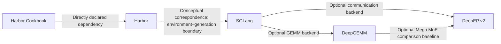

# Infrastructure relationship map: environment feedback, generation scheduling, computation, and communication

Date: 2026-09-08. Stage: L1, source-connection audit. Direction `A → B` means A consumes/depends on B; conceptual correspondence is labeled separately. “Confirmed” on this page means only that interface calls or dependency configuration were observed in pinned source, not that installation or end-to-end execution succeeded.

| Connection | Type | Evidence read | What it establishes / does not establish |
|---|---|---|---|
| Cookbook → Harbor | Direct dependency | [Cookbook pyproject, line 11](https://github.com/harbor-framework/harbor-cookbook/blob/e093c9a860b988d9d74901010ddddb9c7f124f92/pyproject.toml#L11) | The ordinary Cookbook project depends on Harbor; individual training scripts may specify other branches and extra dependencies. |
| SGLang → DeepEP v2 | Optional backend | [Conditional import and retained error, lines 38–45](https://github.com/sgl-project/sglang/blob/30e7a3072d3f1e9bd70cd5e44146ca27c80522c4/python/sglang/srt/layers/moe/token_dispatcher/deepep_v2.py#L38-L45), [actual dispatch, lines 329–345](https://github.com/sgl-project/sglang/blob/30e7a3072d3f1e9bd70cd5e44146ca27c80522c4/python/sglang/srt/layers/moe/token_dispatcher/deepep_v2.py#L329-L345) | An actual V2 adapter exists; this does not imply arbitrary installed versions are compatible or that this is the default path for every SGLang workload. |
| SGLang → DeepGEMM | Optional backend | [Device/importability/configuration checks, lines 18–36](https://github.com/sgl-project/sglang/blob/30e7a3072d3f1e9bd70cd5e44146ca27c80522c4/python/sglang/srt/layers/deep_gemm_wrapper/configurer.py#L18-L36), [masked GEMM call, lines 80–100](https://github.com/sgl-project/sglang/blob/30e7a3072d3f1e9bd70cd5e44146ca27c80522c4/python/sglang/srt/layers/deep_gemm_wrapper/entrypoint.py#L80-L100) | The wrapper selects and calls operators; the existence of an option does not mean a particular model necessarily uses it. |
| DeepGEMM benchmark → DeepEP | Optional test integration | [Baseline dependency loading, lines 15–33](https://github.com/deepseek-ai/DeepGEMM/blob/559d79fb6994a58b8a15b4b93bf13ccc16edf247/tests/test_mega_moe.py#L15-L33), [dispatch/GEMM/combine, lines 281–312](https://github.com/deepseek-ai/DeepGEMM/blob/559d79fb6994a58b8a15b4b93bf13ccc16edf247/tests/test_mega_moe.py#L281-L312) | A separate-pipeline comparison is visible; baseline is skipped if dependency imports fail, so successful fused execution alone does not establish a completed comparison. |
| Harbor ↔ SGLang | Conceptual correspondence | [Harbor default verifier](https://github.com/harbor-framework/harbor/blob/9a2e3b135cc8fb1e41131020f83370cb2f12ae93/src/harbor/verifier/verifier.py#L166-L266); [SGLang scheduler](https://github.com/sgl-project/sglang/blob/30e7a3072d3f1e9bd70cd5e44146ca27c80522c4/python/sglang/srt/managers/scheduler.py#L1893-L1997) | The former produces task feedback; the latter schedules model computation. These code segments do not form a direct software-call relationship; a specific agent/RL integration must establish the connection. |

## Cross-layer data contracts

1. **Environment layer: artifact → reward dictionary.** Harbor's default verifier returns reward dimensions written by the task; it does not automatically generate a `reward` scalar for arbitrary multidimensional results. The training framework should explicitly define scalarization rules; a valid reward file also does not imply that the reward expresses the correct objective.
2. **Serving layer: request → token/KV indices → batches.** Prefix-cache hits require the correct token namespace; KV locked by active requests cannot be evicted. Scheduling optimization must balance TTFT, throughput, and distributed synchronization.
3. **MoE layer: token/top-k → expert rows → original token.** DeepEP handles retain inverse-routing information; DeepGEMM accepts expert-aligned layouts. SGLang's v2 adapter connects the two libraries' shape and synchronization constraints through decode masked and extend contiguous paths.
4. **Compilation layer: shape/layout/dtype → specialized code → cache.** DeepGEMM's cold-start compilation, warm cache, and steady kernel time are different metrics and cannot be collapsed into one throughput conclusion.

## Version and verification boundaries

Cookbook's [`harbor_rl/train.py:3`](https://github.com/harbor-framework/harbor-cookbook/blob/e093c9a860b988d9d74901010ddddb9c7f124f92/harbor_cookbook/harbor_rl/train.py#L3) points to `feature/harbor-rl-4d0`; the Harbor main snapshot in this study does not contain `harbor.rl`. The example is an integration direction backed by code, rather than a claim that this checkout can execute it immediately. Dependencies were not installed, submodules were not initialized, and Docker/GPU execution was not performed here; no verification claims are made for installation compatibility, training convergence, or performance results.

Detailed reading records: [Harbor](../repositories/harbor.md), [SGLang](../repositories/sglang.md), [DeepGEMM](../repositories/deepgemm.md), [DeepEP](../repositories/deepep.md).
