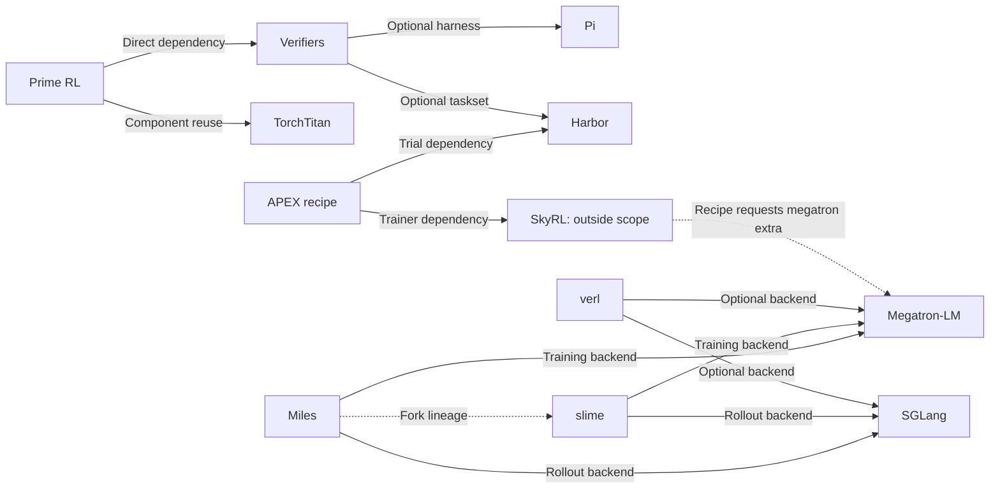

# Connections in RL training systems: token trajectories, environment execution, data queues, and compute backends

Date: 2026-09-08; evidence level: L1 static source reading. Arrows describe software connections, not local installation, compatibility, or completed end-to-end verification.

## Connections confirmed from source

| Source → target | Type | Pinned-snapshot evidence | Interpretation |
|---|---|---|---|
| Prime RL → Verifiers | Direct dependency + submodule | [pyproject dependency and source](https://github.com/PrimeIntellect-ai/prime-rl/blob/04a61d3b75c3c99f263b2c133e822f998909adf7/pyproject.toml#L20-L250), local `.gitmodules` entry `deps/verifiers` | Prime RL uses Episode/Trace from `verifiers.v1`; the training queue lives in Prime RL, while environment lifecycle lives in Verifiers. |
| Prime RL → TorchTitan | Platform-specific direct dependency / component reuse | [Linux dependency](https://github.com/PrimeIntellect-ai/prime-rl/blob/04a61d3b75c3c99f263b2c133e822f998909adf7/pyproject.toml#L54-L62), [git pin](https://github.com/PrimeIntellect-ai/prime-rl/blob/04a61d3b75c3c99f263b2c133e822f998909adf7/pyproject.toml#L240-L250), gradient-clipping import at `src/prime_rl/trainer/utils.py:16` | This is evidence of component reuse, not equivalence of the entire Prime RL trainer with TorchTitan's trainer. |
| Verifiers → Pi | Optional harness integration | [npm version, ACP, and provider configuration](https://github.com/PrimeIntellect-ai/verifiers/blob/27bbd216df0af719a43705866b2cf6139bcc95de/verifiers/v1/harnesses/pi/harness.py#L19-L192) | The model under evaluation/training is supplied to Pi through an interception endpoint; the Pi npm version is pinned separately. |
| Verifiers → Harbor | Optional taskset dependency | [CLI download and task-model import](https://github.com/PrimeIntellect-ai/verifiers/blob/27bbd216df0af719a43705866b2cf6139bcc95de/verifiers/v1/tasksets/harbor/taskset.py#L402-L535) | Harbor task/package formats are adapted to the Verifiers lifecycle; this does not mean every Harbor environment is supported unchanged. |
| APEX recipe → Harbor | Direct dependency | [Trial/TrialConfig imports](https://github.com/Mercor-Intelligence/ApexAgents-SkyRL-Recipe/blob/8e7702f03b7464a36ab800a624fd911de0968a87/apex_agents_skyrl_recipe/tito_harbor_generator.py#L27-L44), [harbor 0.21.0 pin](https://github.com/Mercor-Intelligence/ApexAgents-SkyRL-Recipe/blob/8e7702f03b7464a36ab800a624fd911de0968a87/pyproject.toml#L6-L15) | APEX converts actual trial results into RL generator output. |
| APEX recipe → SkyRL | Direct external dependency | [Fully async trainer import and construction](https://github.com/Mercor-Intelligence/ApexAgents-SkyRL-Recipe/blob/8e7702f03b7464a36ab800a624fd911de0968a87/apex_agents_skyrl_recipe/entrypoints/main_tito_harbor_fully_async.py#L15-L42), [local path source](https://github.com/Mercor-Intelligence/ApexAgents-SkyRL-Recipe/blob/8e7702f03b7464a36ab800a624fd911de0968a87/pyproject.toml#L114-L117) | **SkyRL is outside the scope of the 19 repository clones in this study.** Only the recipe caller was read; there was no local SkyRL trainer to read. |
| APEX recipe → Megatron-LM | Backend dependency through a SkyRL extra | [skyrl[megatron]](https://github.com/Mercor-Intelligence/ApexAgents-SkyRL-Recipe/blob/8e7702f03b7464a36ab800a624fd911de0968a87/pyproject.toml#L6-L15) | This must not be drawn as the recipe directly implementing Megatron training. The intermediate SkyRL layer cannot be omitted. |
| verl → Megatron-LM | Code dependency of an optional training backend | [Engine import](https://github.com/verl-project/verl/blob/7cb65014d3a6c84f59458367df768999e4f36c67/verl/workers/engine/megatron/transformer_impl.py#L15-L84) | Connects control flow with the compute engine. Other verl backends need not go through Megatron. |
| verl → SGLang / vLLM | Optional rollout backend | [setup.py extras](https://github.com/verl-project/verl/blob/7cb65014d3a6c84f59458367df768999e4f36c67/setup.py#L50-L77) | This snapshot declares SGLang 0.5.8; the latest independent SGLang clone is not automatically compatible. vLLM is an external project that was not independently cloned. |
| slime → SGLang | Direct inference integration | [ServerArgs and HTTP server launch](https://github.com/THUDM/slime/blob/4c193f1f37509cca70f0e88807a9305b70f63f4e/slime/backends/sglang_utils/sglang_engine.py#L1-L64) | The training framework actually launches/manages the rollout engine and cannot be treated as merely an API wrapper. |
| slime → Megatron-LM | Training-backend code dependency | [Actor imports / train / weight updater](https://github.com/THUDM/slime/blob/4c193f1f37509cca70f0e88807a9305b70f63f4e/slime/backends/megatron_utils/actor.py#L8-L49) | The backend implementation handles parallel computation and weight synchronization. |
| Miles → slime | Project lineage | [Fork declaration in Miles README](https://github.com/radixark/miles/blob/3de96596f16b9e6d23ba550c4c47de3479c9f14c/README.md#L107-L112) | A fork relationship is neither a runtime dependency nor a guarantee of API equivalence. |
| Miles → Megatron-LM | Training-backend code dependency | [Import of Core layer-layout functions](https://github.com/radixark/miles/blob/3de96596f16b9e6d23ba550c4c47de3479c9f14c/miles/backends/megatron_utils/replay_utils.py#L1-L24) | MoE replay must match PP/VPP local-layer layouts. |
| Miles → SGLang | Direct inference integration | [ServerArgs and launch command](https://github.com/radixark/miles/blob/3de96596f16b9e6d23ba550c4c47de3479c9f14c/miles/backends/sglang_utils/sglang_engine.py#L1-L68) | This reading verified the connection entry point without auditing the full combination of launch arguments. |

The SkyRL→Megatron edge in the diagram reflects intent established by APEX's extra request; the specific internal SkyRL execution chain was not read locally. The table is authoritative for the diagram's factual precision.

## Learning questions across these projects

### 1. Who produced this token, and who should receive gradients for it?

[APEX](../repositories/apex-agents-skyrl-recipe.md)'s `TITOAgentState` strictly appends sampled and observation tokens; [slime](../repositories/slime.md)'s trajectory manager must also handle message rewriting, token drift, and shared prefixes. This is **conceptual correspondence**, not a dependency between them.

A reusable checklist is: the boundary between complete tokens and the response region, tool-observation masks, sampled logprobs, stop tokens, branch deduplication, and group identity. Readable text alone cannot guarantee correct RL probability/gradient correspondence.

### 2. With the same “GRPO” name, is actual normalization the same?

In this reading, [verl](../repositories/verl.md)'s `compute_grpo_outcome_advantage` defaults to grouping by uid and dividing by group standard deviation, whereas [Prime RL](../repositories/prime-rl.md)'s `GRPOAlgorithm.score_group` defaults to subtracting only the mean. These observations cover only the functions read; subsequent loss/configuration cannot be ignored in claiming that they are exactly the same algorithm.

Before comparing system throughput, include reward shaping, advantage normalization, loss denominator, group size, filtering rules, and sampling distribution together among experimental controls.

### 3. Are system failures being mixed into model-capability evaluation?

Verifiers distinguishes failed from normal stopped, APEX distinguishes error, timeout, length, and context_length, and Prime RL distinguishes task results from stale cancellation. At different layers, they address the same question: data-collection failure cannot unconditionally be treated as a wrong model answer, nor can all failures be silently removed before reporting an attractive success rate.

Unified observation should include at least all attempts, completed gradable trajectories, trajectories that ultimately enter training, dropped/cancelled counts by reason, valid tokens, and wall time.

### 4. Once tokens agree, do internal computation paths also agree?

[Miles](../repositories/miles.md)'s routing replay traces consistency down to discrete MoE expert indices and handles microbatch/CP/SP/PP alignment, connecting to rollout execution in [SGLang](../repositories/sglang.md) and the training-parallelism layer in [Megatron-LM](../repositories/megatron-lm.md).

DeepEP/DeepGEMM are conceptually related through communication and matrix computation, but the RL paths read here do not provide enough evidence to draw both as direct dependencies throughout. Dependencies must be traced through configuration/imports/call chains, rather than inferred from project prominence.

## Independent clones do not imply aligned dependency locks

- Prime RL's `deps/verifiers` gitlink is `828488fffe31aa3332b9d1bd4bd9ee320e375cf1`; this learning repository's independent Verifiers snapshot is `27bbd216df0af719a43705866b2cf6139bcc95de`.
- APEX pins Harbor 0.21.0 and points to a SkyRL 0.3.0 release-checkout path on the author's machine; that path is absent locally, and SkyRL is not counted among the 19 repositories.
- Verifiers' Pi adapter uses npm release 0.84.1; the adjacent Pi source is an independent HEAD.
- verl's SGLang extra pin and the independent SGLang HEAD should be managed separately.

These differences do not prevent L1 reading, but affect L3 reproduction. Each training experiment should separately record a lock of the backend/model/tokenizer/dataset/image/config actually used, preserving this learning repository's independent snapshots for comparison.
